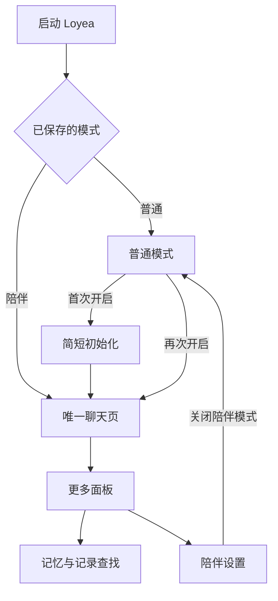

# Loyea 陪伴模式 UI 与功能规格

版本：0.1（修订 1）｜状态：三项产品决定已确认，其余细节供评审｜日期：2026-09-08｜面向：下游开发 Agent

本期目标：开启陪伴模式后，Loyea 直接进入一个持续的聊天界面；日常使用围绕聊天、记忆和现实环境展开。保留普通模式的使用方式，复用现有 Android 能力。人格算法、情绪模型与精细人格编辑留到后续。

本文件规定待实现行为，不代表功能已经开发或通过真机验收。第 1.2 节的三项决定已由用户确认，其余新增细节是本稿的产品建议。本次修订补充 Operit Android 项目的代码参考，保持人格系统与跨应用陪读后置。

## 1. 依据与范围

### 1.1 已明确的需求

| 编号 | 用户已明确的要求 |
|---|---|
| C-01 | Loyea 是主要运行于 Android 手机的应用。 |
| C-02 | 新增可开启的陪伴模式，开启后只有一个会话界面。 |
| C-03 | 陪伴模式隐藏角色卡、世界书等配置功能。 |
| C-04 | 陪伴模式的物理感知总开关默认开启。 |
| C-05 | 优化记忆管理；本期重点为 UI 和程序功能，人格系统后置。 |
| C-06 | 关注手机的算力开销、耗电与发热。 |

### 1.2 已确认的产品决定

| 编号 | 已确认方案 | 实现约束 |
|---|---|---|
| D-01 | **内置 Loyea** 作为陪伴对象；可改显示名称与头像，不开放角色选择。 | 角色卡、世界书的管理入口在陪伴模式中隐藏；精细人格另行设计。 |
| D-02 | 首次开启时创建**独立长期会话**，不自动搬入普通模式的聊天或记忆。 | 普通记录保留；不开启自动接管、拼接或跨模式记忆共享。 |
| D-03 | 本期完成 **App 内陪伴**；跨应用陪读、悬浮窗、音乐同步另列后续功能。 | Operit 中的相关能力可作后续参考，不因找到实现而自动加入本期。 |

确认依据：用户在三项方案复述后回复“没问题的”，随后提出将 OperitAI 纳入研究参考。无需重复询问这三项。

### 1.3 已核对的代码基线

仓库：[ApolloEddy/Loyea](https://github.com/ApolloEddy/Loyea)。本次核对的 main 提交为 [`79a843e`](https://github.com/ApolloEddy/Loyea/commit/79a843e02e1d246bb74b55eef03b07458371ebe0)，README 标示 v0.8.0。工程使用 **Kotlin、Jetpack Compose / Material 3**，由 app 与静态 character-core 两个模块组成。

| 当前实现 | 本期处理 |
|---|---|
| 手机抽屉、平板双栏、会话列表与角色选择 | 陪伴模式使用单会话导航；普通模式维持现有导航。 |
| 顶部角色／模型选择器、世界书按钮、新会话按钮 | 陪伴模式改为对象名称与简洁操作入口。 |
| 文本、图片、语音、流式回复、重生成、多版本、朗读 | 复用现有请求与消息组件，调整默认呈现。 |
| 消息窗口渲染、滚动定位、未读提示、时间分隔 | 保留并纳入长会话回归验收。 |
| 会话核心记忆、图谱记忆、早期摘要、后台整理 | 调整管理入口、数据归属和用户纠错行为。 |
| 会话级物理感知字段 useSystemTime、工具授权 | 增加陪伴模式初始化与统一的权限／状态呈现。 |
| GreetingWorker 主动问候 | 明确目标会话、免打扰、去重和模式切换行为。 |
| 会话 Markdown／JSON 导出、JSON 导入 | 增加陪伴数据备份范围与恢复语义。 |

旧的重构 Spec 是历史背景，不再以回退至 v0.5.5 为本期前提。实现前核对仓库的新提交，在当前有效基线上增量开发。

### 1.4 本期与后续

**P0：本期验收必需。** 模式切换、唯一长期会话、聊天 UI、基础资料、记忆管理、记录查找、感知控制、既有主动问候整合、数据备份恢复、异常与资源控制。

**后续独立规格。** 精细人格编辑、Soul Anchor 的完整设计、情绪状态演化、本地情绪模型、MoE、跨应用陪读、悬浮窗、音乐陪伴、实时语音通话、新的云同步服务。

本期不新增插件框架、向量数据库、角色市场、关系等级、好感度数值、每日任务或大面积动态角色展示。

## 2. 产品结构与导航

“只有一个会话界面”指只有一个可持续交谈的入口。资料、记忆、查找记录和设置仍可使用二级页面，不构成新的会话。

| 页面 ID | 页面 | 入口与返回 |
|---|---|---|
| S-01 | 首次开启 | 普通模式设置 → 陪伴模式；完成进入 S-02，取消回原页面。 |
| S-02 | 陪伴聊天 | 开启后的启动首页；系统返回键在关闭键盘、临时面板后按 Android 默认行为返回桌面。 |
| S-03 | 更多面板 | 聊天页右上角 ⋮；下拉、点外部或返回键关闭。 |
| S-04 | 陪伴设置 | 更多面板 → 陪伴设置；返回原聊天位置。 |
| S-05 | 记忆 | 更多面板 → 记忆；可查看、添加、修改、固定、删除。 |
| S-06 | 查找记录 | 更多面板 → 查找记录；点结果回到同一聊天时间线。 |
| S-07 | 感知与主动联系 | 陪伴设置中的独立分组／二级页。 |
| S-08 | 数据管理 | 陪伴设置 → 数据与备份；承载导出、恢复和重新开始。 |

**NAV-01** 陪伴模式不出现会话抽屉、会话列表、新建会话、角色酒馆、世界书入口；平板与横屏也不显示普通模式侧栏。

**NAV-02** 从设置、通知、系统返回和冷启动进入时，由同一模式解析逻辑确定页面。隐藏入口对应的普通模式页面不能因旧导航状态自动弹出。

**NAV-03** 关闭陪伴模式是设置中的明确操作。关闭后返回最近的普通会话；再次开启恢复原陪伴记录、记忆、草稿和个人设置。

**NAV-04** 在陪伴模式内进入设置、记忆页、记录查找或图片预览，只改变界面，不取消原聊天请求、不重新生成、不丢失正在运行的状态。进程仍存活时返回页面应订阅同一回合的最新状态；用户明确关闭陪伴模式时按 FUN-06 执行。此项不承诺进程被系统杀死后继续网络推理，也不要求新增常驻服务。

## 3. UI 设计

### 3.1 视觉方向与布局规则

沿用 Loyea 现有暖沙色主题和品牌资源。通过减少常驻控件、稳定聊天布局体现陪伴模式，不另造一套视觉体系。

| 元素 | 规格 |
|---|---|
| 浅色主题 | 复用背景 #F9F6F0、正文 #191919、表面 #F3EFE6、主色 #CC5A37。 |
| 深色主题 | 复用背景 #191816、正文 #EADFC9、表面 #2E2A27、主色 #E08A6F。 |
| 内容留白 | 手机左右基础边距 16 dp；组件间距优先采用 8／12／16／24 dp。 |
| 标题与正文 | 标题建议 18–20 sp，聊天正文沿用现有字号；随系统字体缩放，不固定字符容器高度。 |
| 点击区域 | 图标可视尺寸约 24 dp，交互区域至少 48 × 48 dp；头像视觉尺寸 32–36 dp。 |
| 气泡与正文 | 保留现有用户气泡、AI 文本和 Markdown 风格；不为每次回答增加整块卡片背景。 |
| 动效 | 仅页面切换、面板展开和消息必要过渡；不加持续呼吸光效、粒子、背景视频或逐字额外重播。 |
| 大屏 | 聊天内容居中，建议最大宽度 760 dp；仍是一个聊天面板。设置页复用现有窄内容布局。 |
| 背景与主题 | 沿用用户现有主题／气泡颜色配置；自定义背景应保证正文可读。 |

配色来自当前 Color.kt。尺寸为本稿建议值，不要求重绘普通模式。48 dp 触控区域依据 [Compose 无障碍默认规则](https://developer.android.com/develop/ui/compose/accessibility/api-defaults)。

### 3.2 S-01 首次开启

使用一个可滚动的简短设置页，不设计多页问卷。

从上到下：

1. 标题“开启陪伴模式”，一行说明“用一个持续的聊天，记录你们的日常”。
2. 小头像与显示名称，默认 Loyea；名称和头像可稍后修改。
3. “物理感知”开关默认开，说明“按需使用已允许的环境信息”。展开后可查看各项授权。
4. “主动联系”开关：有明确保存的用户选择时继承该选择；未设置过时本稿建议默认关闭，可在此开启。关闭不影响其他陪伴功能。
5. 一行说明“普通模式的聊天会保留”。独立会话按已确认的 D-02 执行。
6. 主按钮“开始陪伴”，次按钮“暂不开启”。

**UI-01** 未配置聊天服务时，在此显示“先配置聊天服务”及入口。已填的名称与选择保留，返回后继续；不用重新填写所有 API。

**UI-02** 不在点击开启后集中请求定位、麦克风、健康连接等所有权限。总开关开启与具体权限可用是不同状态；拒绝非必要权限仍可开始聊天。

**UI-03** 点击“开始陪伴”后才提交初始化；按钮在保存时禁用防重入。失败显示可重试状态，不把半成品设为当前模式。

### 3.3 S-02 唯一聊天页

| 区域 | 内容与交互 |
|---|---|
| 顶栏左侧 | 头像和显示名称，点击进入基础资料；不显示模型名称、会话标题或关系数值。 |
| 顶栏右侧 | 一个 ⋮ 按钮，打开 S-03。 |
| 顶栏下方 | 仅有任务执行时显示简短状态，如“正在回复…”“正在查找资料…”。结束后消失。 |
| 主体 | 连续消息时间线，沿用当前文本、图片、语音、时间分隔与未读提示。 |
| 输入区 | 复用现有文本输入、附件、语音及发送／停止切换；长文本保留放大编辑。 |
| 临时内容 | 图片待发送预览、录音反馈、失败重试就近出现；不挤占永久功能区。 |

**UI-04** 顶栏不保留模型选择器、世界书按钮、新会话按钮；不以透明占位或禁用按钮留下空隙。

**UI-05** 模型切换移至“陪伴设置 → 聊天服务”，仍可选已有配置。Token 用量、模型参数和工具诊断放在该页面的“高级”区。

**UI-06** 回复默认突出文本。原有思考块、工具执行细节默认折叠，可从消息菜单的“处理详情”查看；需要用户操作的确认、错误和引用来源仍须可见。

**UI-07** 消息的复制、朗读、重新生成、回复版本切换收进长按菜单或选中后的操作区。语音／音频消息的播放按钮保持可见，长按功能提供无障碍操作入口。

**UI-08** 沿用现有重生成和消息编辑语义，不在本期新增分支会话。流式输出中不允许同时生成另一个版本；已停止的部分回复保留并标明状态。

**UI-09** 第一次进入空会话时显示头像和轻量占位语“想聊什么都可以”。占位语不是历史消息、不调用模型；用户发出第一条消息后消失。后续启动不重复插入欢迎语。

**UI-10** 不显示未经数据支持的“在线”“想你了”“心情低落”等状态。真实的回复、录音、联网执行状态与人格状态分开。

**UI-11** 键盘弹出、图片预览、横竖屏切换不能遮挡输入框或改变草稿。使用窗口边衬处理状态栏、导航栏和键盘，不叠加重复底部留白。[Compose Window Insets](https://developer.android.com/develop/ui/compose/system/insets)

### 3.4 S-03 更多面板

从底部弹出的短面板，顺序固定为“记忆”“查找记录”“陪伴设置”，底部附“物理感知”快捷开关。无需滚动即可容纳基础入口；大字体下允许自然滚动。

**UI-12** 快捷开关和设置页读取同一状态。仅当“总开关开、部分来源不可用”时附“部分可用”，点击行内详情可查看原因。

**UI-13** 面板不列角色卡、世界书、会话管理、提示词模板、记忆权重、图谱拓扑或情绪参数。

### 3.5 S-04 陪伴设置

采用已有 Material 3 列表和二级页面，避免把普通设置页完整复制后逐项藏按钮。

| 分组 | 可见内容 |
|---|---|
| 基础资料 | Loyea 显示名称、头像、用户希望被称呼的名字。 |
| 聊天体验 | 聊天服务、语音与朗读、外观；沿用现有能力配置。 |
| 感知与联系 | 物理感知、来源权限、主动联系、免打扰。 |
| 记录 | 记忆管理、数据与备份。 |
| 其他 | 高级设置、关于、关闭陪伴模式。 |

**UI-14** 基础资料只提供显示层设置。没有人格滑杆、MBTI 选择、情绪模型开关或空置的“人格系统敬请期待”。

**UI-15** 模型、语音服务、主题、语言等公共设置复用同一份配置，不创建第二套 API Key。陪伴名称、感知开关、主动联系和记忆策略是陪伴范围的设置。

**UI-16** 高级区可管理模型参数、既有外部工具和用量，但陪伴模式中的任何设置层级均不开放角色卡与世界书管理。需要这些功能时关闭陪伴模式。

### 3.6 S-05 记忆

页面标题“记忆”，顶部是本地搜索和“添加”按钮，下方分为“固定记忆”和“其他记忆”。各条以可读短句显示；时间及“手动添加／自动整理”等真实来源在详情展开，不展示三元组原始 JSON 和衰减权重。

| 操作 | 行为 |
|---|---|
| 添加 | 用户输入一句希望长期保留的事实，保存为固定记忆。 |
| 查看 | 展示全文；有真实来源时可跳至相关聊天，无来源的旧数据不伪造出处。 |
| 修改 | 修改内容成为用户确认的固定记忆；使被替代的旧条目退出有效召回。 |
| 固定／取消固定 | 固定内容不被自动整理覆盖；取消固定后归入其他记忆、可参与自动整理，但不改写其实际来源。 |
| 删除 | 移除选中条目及其有效缓存；不删除原始聊天。 |
| 立即整理 | 放在页面菜单中，复用现有后台整理；进行中可离开页面，不重复启动。 |

**UI-17** 对删除操作说明“会删除这条记忆，聊天记录仍保留”。本期不把它命名为“彻底忘记”；旧聊天之后仍可能支持新的提取。

**UI-18** 记忆为空时显示“还没有保存的记忆”和“添加”；加载失败时保留现有内容并提供重试。自动整理失败不阻塞聊天，也不清空旧记忆。

**UI-19** “自动整理记忆”开关放在此页设置中，默认开。关闭表示暂停新的自动提取，已保存内容仍可用于聊天；上下文窗口压缩属于对话运行能力，单独在高级说明中解释。

### 3.7 S-06 查找记录

**UI-20** 首版提供当前陪伴会话的本地关键词搜索，匹配已落盘的文本、语音转写与图片描述；不为搜索调用模型，不宣称能搜索图片内部的文字。

**UI-21** 每条结果显示时间、发言者和匹配片段；点结果加载并定位到原消息、短暂高亮。回到最新消息沿用现有悬浮按钮，不创建历史子会话。

**UI-22** 空查询不搜索；快速输入取消旧查询，最后一次查询结果才可上屏。历史搜索覆盖完整记录，不能仅搜索当前 UI 渲染窗口。

## 4. 模式与会话功能

**FUN-01 唯一会话。** 持久保存陪伴会话 ID；首次创建一次，此后启动、跨天、切换模型、打开设置或上下文压缩均不得创建新会话。后端存储可分段，用户仍看到一条时间线。

**FUN-02 数据归属。** 普通模式与陪伴模式的消息、草稿、核心记忆、图谱记忆和早期摘要分别归属。陪伴会话不出现在普通会话列表，不会被普通模式的批量清理误删。

**FUN-03 内部资料。** D-01 已确认使用内置基础设定的独立副本，使用独立标识；复用 character-core 的编译能力。普通角色编辑不会连带改动陪伴对象。

**FUN-04 世界书策略。** D-01 的陪伴资料默认明确“不使用世界书”，不继承普通模式的全局生效书、角色卡正则或剧情状态。此规则仅作用于陪伴对象，普通模式的书库与绑定保留。

**FUN-05 开关默认。** 仅在首次创建陪伴配置时将物理感知设为开。用户关掉后，重启或再次开启陪伴模式不得替用户重开。

**FUN-06 切换过程。** 切换模式前保存草稿；停止当前前台生成、录音与播放，已接收内容保留，未发送录音不自动发出。界面和会话绑定在初始化／读取成功后一起切换，失败返回原模式。

**FUN-07 异步归属。** 每次聊天、图注、转写、记忆整理与问候任务捕获目标会话和有效版本；写回时再次核对。切换模式后不得写入新显示的会话；重置／恢复使旧任务失效。

**FUN-08 启动恢复。** 先解析模式与陪伴绑定再显示首页，避免先闪现普通抽屉。仅恢复页面不得触发额外模型调用或欢迎消息。

**FUN-09 缺失数据。** 陪伴绑定存在但记录缺失或损坏时进入恢复状态，提供重试、恢复备份或明确重新开始；不静默新建空会话并冒充原记录。

**FUN-10 通知跳转。** 陪伴消息通知始终指向该陪伴会话。陪伴模式下点击旧普通会话通知时，提供“切换普通模式查看”的明确入口，不暗中改变模式或把旧消息塞进陪伴记录。

## 5. 感知与主动联系

### 5.1 感知行为

总开关表示允许按需使用感知能力，不等于后台持续采集，也不等于已经取得所有 Android 权限。

| 来源 | 本期规则 |
|---|---|
| 时间、电量与充电 | 在必要的回合／工具调用时读取；总开关和来源配置仍有效。 |
| 环境光、运动状态 | 使用已有来源；传感器缺失时返回不可用，不用虚拟数据补成实测。 |
| 位置与天气 | 沿用授权与来源选择；定位不可用时不擅自提升到持续或后台定位。 |
| 麦克风与环境噪声 | 沿用授权；噪声工具仅按需短时采样，不为此常驻录音。 |
| 蓝牙、Wi-Fi、健康连接 | 按系统权限和来源能力开放；缺少设备或数据源时可以保持不可用。 |

**PER-01** 感知页逐项区分“已关闭”“待授权”“可用”“无数据／设备不支持”。未授权时通过用户点击再进入相应系统授权流程，拒绝后不循环弹窗。

**PER-02** UI 开关、回合上下文、工具列表、实际工具执行、后台问候、记忆提取统一检查总开关与来源授权。不能前台禁用了某来源，后台组装完整物理快照时又把它读取出来。

**PER-03** 关闭总开关后停止新增采集与尚未完成的感知结果注入。沿用现有关闭感知后的历史快照／敏感记忆过滤；已发送给模型的请求无法撤回，不声称已撤回。

**PER-04** 明确区分实际采集、缓存、手动位置和模拟数据；无实际来源时使用“未知／不可用”。感知失败不阻塞普通文本聊天。

**PER-05** 感知页用一句话说明“使用到的环境信息可能随对话发送给你配置的模型服务”。不以“本地存储”表述代替真实的数据流说明。

### 5.2 主动联系行为

沿用现有后台问候能力，本期优化触发与交付，不重新设计人格动机系统。它与物理感知各自有开关：感知关闭时，主动联系仍可基于已有聊天工作。

| 设置／条件 | 本稿建议默认 |
|---|---|
| 开关 | 初始化规则见 S-01；用户可随时关闭。 |
| 免打扰 | 23:00–08:00，按设备当地时间，可修改；支持跨午夜区间。 |
| 频率限制 | 每日最多 2 条、间隔至少 4 小时；作为内部初始策略，普通 UI 不放分钟级调参。 |
| 正在交谈 | 前台正在输入／录音／生成，或最近一次用户消息不足 30 分钟时跳过。 |
| 未回应 | 上一次主动联系后用户尚未发言时，不连续追加问候。 |
| 无有效内容 | 生成结果为空、失败或判定无需联系时不落盘、不发通知。 |

**ACT-01** 后台任务显式绑定陪伴会话。现有代码读取 current_session_id 的方式不能直接作为陪伴任务目标。任务开始与写入前都复核模式、开关、免打扰和会话有效性。

免打扰时段与每日次数按当前设备时区计算；执行前重读时区。跨时区不补发遗漏问候，最短间隔按实际经过时间判断，避免手动调时导致短时间连发。

**ACT-02** 关闭主动联系或退出陪伴模式时取消待执行的陪伴问候；普通模式原有开关保留。两种模式不重复调度同一问候链。

**ACT-03** 主动消息落入同一时间线；唯一事件 ID 防止重试写入两遍。正在查看该聊天时只显示消息，后台且通知获准时才发系统通知。

**ACT-04** 未授予通知权限时不假装通知已经送达；本稿默认暂停后台主动生成，设置中显示“开启通知后可主动联系”。不开启仍可正常聊天。

**ACT-05** 通知内容预览遵循系统锁屏隐私设置。点通知加载已保存消息，不重新调用模型生成一次。

**ACT-06** 使用现有 WorkManager 做可延迟任务，不承诺整点送达，也不为问候新增常驻服务、精确闹钟或要求用户关闭全部电池优化。系统推迟任务时不补发一串错过的问候。[Android 持久后台任务](https://developer.android.com/develop/background-work/background-tasks/persistent)

## 6. 记忆与数据管理

### 6.1 记忆一致性

**MEM-01** 先为现有核心记忆与图谱记忆提供统一管理视图；不另建一套与聊天实际使用内容无关的展示库。旧记录通过适配层呈现，不强行重跑全量模型提取。

**MEM-02** 为可编辑条目提供稳定 ID、所属会话、内容、固定状态与修订信息。来源消息 ID、更新时间仅在确实有记录时展示，旧数据允许缺失。

**MEM-03** 图谱条目被用户改成自然语言事实时，可保存为固定核心记忆并停用原条目；不要求客户端把用户短句再解析成三元组才能保存。

**MEM-04** 用户编辑、固定、删除之后，晚到的自动整理任务不得覆盖该操作。自动写入必须合并最新固定条目，并通过修订检查或等价机制拒绝过期结果。

**MEM-05** 编辑／删除同步使相应召回缓存失效，下一轮请求读取新状态。用户修正的内容具有明确优先级；本期不承诺对全部旧聊天执行语义级删除。

**MEM-06** 长会话摘要服务于上下文预算，不删除原始聊天。用户仍能查找和翻阅摘要覆盖过的消息；后台提取与主聊天流的预算策略复用当前有效实现。

**MEM-07** 自动提取合并新完成回合后按既有阈值触发；不因每个流式片段、每次重组 UI 或打开记忆页重复运行。单个会话的整理任务去重。

**MEM-08** 自动整理允许返回“无新增记忆”，此时保持现有内容不变。对同一来源或内容规范化后相同的条目去重；更新或合并只能作用于当前陪伴范围中的有效条目，并遵守固定记忆保护。先利用现有批次与存储完成，不为判断是否值得记忆而新增逐条模型请求，也不将任意相似句强行合并成同一事件。

**MEM-09** 陪伴对象的基础设定、用户确认的资料、从聊天提取的事件记忆保持不同归属与写入规则。自动整理不能顺带修改陪伴对象的核心设定，不能把其他角色记忆写进用户资料。本期沿用“固定记忆／其他记忆”的管理 UI；不另加 user.md 编辑器或人格设置页。

### 6.2 S-08 数据与备份

| 操作 | 必须包含的行为 |
|---|---|
| 导出聊天 | 使用现有 Markdown 导出，可读但不称为完整备份。 |
| 导出陪伴备份 | JSON 含版本、陪伴资料、消息与版本／时间、核心与图谱记忆、早期摘要、必要的用户修改记录和陪伴范围设置。 |
| 恢复陪伴备份 | 先校验格式与版本，展示名称、消息数量、时间范围，再让用户确认替换当前陪伴数据；不拼接两段不同关系记录。 |
| 重新开始 | 清除当前陪伴的聊天、记忆、摘要、草稿和待执行任务，保留公共服务配置；操作前明确范围并提供导出入口。 |

**DATA-01** 备份不含 API Key、Android 授权令牌或健康连接授权。恢复后绑定本机已有聊天服务，权限按本机实际状态重新判断。

**DATA-02** 首版不要求把外部图片／音频二进制打包进 JSON。导出时明确“包含聊天与记忆，图片和音频文件不随备份迁移”；恢复时保留文字描述与附件缺失占位，不显示损坏控件。

**DATA-03** 备份生成一致快照；恢复采用临时数据校验成功后原子切换。解析失败、磁盘不足或中断保留当前有效数据，不产生半新半旧状态。

**DATA-04** 恢复时重新映射运行中的会话与记忆归属标识，更新任务代际；不能信任备份中的旧 ID 去覆盖其他会话。恢复成功后重新判断通知与感知的实际可用性。

**DATA-05** 重新开始／替换备份使所有旧回调失效，不能被晚到的回复、图注、记忆整理或问候重新写回。普通模式的数据不受这些陪伴操作影响。

**DATA-06** 关闭陪伴模式只切换入口，永不视作清空数据。日常菜单不摆放“清空全部”，此操作只在数据管理底部出现。

## 7. 状态与异常

| 场景 | 用户看到的状态 | 程序行为 |
|---|---|---|
| 正在恢复本地记录 | 轻量载入状态 | 完成模式与绑定解析后一次显示正确聊天，不闪现普通首页。 |
| 聊天服务缺失 | “配置聊天服务”及按钮 | 允许看历史和改设置；发送不静默失败。 |
| 网络／API 失败 | 失败消息旁“重试” | 保留已发送内容和草稿；重试不重复插入用户消息。 |
| 回复进行中 | 简短状态和停止按钮 | 单轮串行；文本、语音、图片入口统一防重入。 |
| 用户上滑看历史 | 原阅读位置、返回最新按钮与未读数 | 流式输出不强制拉回底部；点按钮才恢复跟随。 |
| 感知权限不足 | 设置中“待授权／部分可用” | 其余可用来源和普通聊天继续工作。 |
| 记忆整理失败 | 记忆页内提示，可重试 | 旧内容保留，聊天继续。 |
| 后台任务被推迟 | 无假通知、无错误对话气泡 | 恢复执行时重新判断是否仍有发送必要。 |
| 记录损坏 | 恢复入口 | 保留故障数据，不静默清空。 |
| 系统回收进程／旋转 | 恢复已保存记录、草稿及合理滚动位置 | 不承诺被杀死的网络流自动续接，不重复发出请求。 |

提示文案面向实际问题，不把 sessionId、Token、Worker、JSON、权限栈或错误堆栈直接写进聊天。确需排查的信息收进高级详情。

## 8. Android 与资源要求

**NFR-01** 复用 Kotlin／Compose 技术栈与既有组件。只抽取为两种模式共享而确有需要的聊天展示组件，不以本期为由整体重写 ChatViewModel。

**NFR-02** 本期不加载文本情绪 ONNX 模型、不新增持续情绪推理。感知、消息搜索和记忆工作按事件触发，退出相关功能后释放监听与临时资源。

**NFR-03** 磁盘读写、历史搜索、备份和模型调用不占用主线程。保留已有消息窗口渲染，使用稳定消息标识；不能因为单会话而一次绘制全部历史。

**NFR-04** 聊天之外不维持高频轮询、屏幕常亮或新常驻服务。需要系统通知的实际后台任务仍遵循 Android 生命周期，不为了视觉简洁隐藏系统要求的通知。

**NFR-05** 大字体、TalkBack、键盘、深色主题和至少手机窄屏／横屏／平板三类布局可用；控件不只靠颜色区分状态，点击区域不因图标变小而缩小。

**NFR-06** 以同一提交的普通模式作为对照，记录真实 Android 设备上的启动、滚动、内存和发热。普通模式与陪伴模式须使用相同消息、模型、屏幕亮度、网络和充电条件；不将云端延迟归因于 UI。

**NFR-07** 建议使用 1 万条合成消息验收长会话与跨窗口搜索，并做一次 20 分钟相同脚本的开关对照。验收须无 ANR、无重复后台任务、退出后无遗留高频工作；是否发热需实测，不能仅按代码或模型体积判定。

## 9. 实现落点与最小数据合同

本节用于避免只改 UI；不要求照搬类名或新增模块。

| 位置 | 改动目的 |
|---|---|
| MainActivity.kt | 启动路由、通知入口与模式恢复；统一后台任务调度入口。 |
| ui/main/MainScreen.kt | 按模式提供导航外壳；陪伴模式不构建普通抽屉和双栏。 |
| ui/chat/ChatScreen.kt | 顶栏、更多面板、消息详情呈现；复用输入与时间线。 |
| ui/settings/SettingsScreen.kt | 提供陪伴设置入口与按模式裁剪的公共设置路由。 |
| ui/chat/ChatViewModel.kt | 绑定长期会话、切换动作、异步归属与设置联动。 |
| ui/chat/ChatStorageManager.kt | 陪伴归属、普通列表过滤、初始化与数据恢复。 |
| storage/CharacterDocumentStore.kt | 内部陪伴资料保存；复用角色文档能力但不暴露卡编辑。 |
| ui/chat/PromptAssembler.kt | 传入明确陪伴资料／世界书策略，保留记忆、权限和上下文预算合同。 |
| perception/PhysicalContextManager.kt 与 PerceptionMcpServer.kt | 前后台共享感知开关和来源授权判断。 |
| worker/GreetingWorker.kt | 显式会话目标、免打扰、限频、去重、切换后失效。 |
| worker/MemoryConsolidationWorker.kt 与 perception/memory/GraphMemoryManager.kt | 统一记忆视图的归属与修订保护，防止覆盖用户编辑。 |

建议最小合同：

| 数据 | 需要表达的语义 |
|---|---|
| AppMode | NORMAL 或 COMPANION；缺失时按旧版普通模式解析。 |
| CompanionConfig | 稳定陪伴 ID、会话 ID、内部资料 ID、显示资料、感知与主动联系设置、配置版本。 |
| LastNormalSession | 返回普通模式的恢复位置；不拿它做陪伴任务目标。 |
| SessionScope | 能区分普通与陪伴归属；已有会话默认 NORMAL。 |
| TaskContext | 目标会话、有效代际、必要配置快照；不能只持有可变的 currentSessionId。 |
| MemoryView | 为已有记忆提供稳定 ID、内容、固定状态、来源和修订信息的适配视图。 |

已有 bindingRevision／sessionIncarnationId 可在核对语义后复用，不另造含义相同却互不校验的多套版本字段。继续使用现有持久化方式与原子写入；只有发现具体容量或一致性问题时才另评存储迁移。

人格阶段的唯一预留是：界面资料、记忆和未来人格状态可分别更新；当前回复路径不依赖未来情绪模型存在。不在本期定义人格维度、训练方案或情绪到提示词的完整算法。

## 10. 验收清单

以下均为待执行验收，不是当前结果。自动测试优先覆盖数据归属、失效回调和恢复；布局与系统行为用界面测试／真机验证。

| 编号 | 场景与通过条件 | 对应要求 |
|---|---|---|
| AC-01 | 老用户升级后仍在普通模式，已有角色、书库、会话和服务配置可用。 | C-03、FUN-02、UI-15 |
| AC-02 | 首次开启完成后只有一个陪伴会话；连续点击初始化不会重复创建。 | UI-03、FUN-01 |
| AC-03 | 退出、重启、跨天、切换模型、再次开启均恢复同一陪伴 ID 和历史。 | FUN-01、FUN-08 |
| AC-04 | 陪伴模式的手机、横屏和平板均无抽屉、新会话、角色卡或世界书入口。 | NAV-01、UI-04、UI-16 |
| AC-05 | 关闭模式回到原普通会话，再开启保留陪伴草稿、记忆和设置。 | NAV-03、FUN-02、DATA-06 |
| AC-06 | 内置陪伴不继承普通模式的全局世界书；普通会话的书仍正常生效。 | FUN-03、FUN-04 |
| AC-07 | 物理感知首次为开；用户关闭后多次切换和重启仍为关。 | FUN-05 |
| AC-08 | 拒绝定位／麦克风／健康权限仍能文本聊天；状态不冒充可用。 | UI-02、PER-01、PER-04 |
| AC-09 | 关闭感知或单一来源后，前台工具与后台问候均不新增该来源数据。 | PER-02、PER-03 |
| AC-10 | 文本、图片、录音、取消录音、转写、朗读、停止、重生成在新布局可用。 | UI-07、UI-08、FUN-06 |
| AC-11 | 字体放大与键盘弹出不遮挡发送按钮；TalkBack 可找到消息操作。 | UI-11、NFR-05 |
| AC-12 | 翻阅旧消息时新回复不抢滚动；回到底部和未读状态正确。 | UI-21、NFR-03 |
| AC-13 | 1 万条消息可搜索到渲染窗口外的匹配项并跳转原位置。 | UI-20、UI-22、NFR-07 |
| AC-14 | 添加／修改／固定的记忆重启后有效，下一轮实际请求使用新状态。 | MEM-01～05 |
| AC-15 | 记忆删除后，已在运行的旧整理任务不能把同一旧结果写回来。 | MEM-04、MEM-05 |
| AC-16 | 模式切换或资料恢复时，晚到回复、图注、转写不写入错误会话。 | FUN-07、DATA-05 |
| AC-17 | 免打扰、限频、未回应、正在聊天条件分别阻止主动联系；时区变化后重新计算。 | ACT-01、主动联系条件表 |
| AC-18 | 关闭主动联系／退出模式后旧任务不再落盘或通知；重试事件不重复。 | ACT-02、ACT-03 |
| AC-19 | 通知跳入正确会话且不重新生成；旧普通通知不绕过模式导航。 | FUN-10、ACT-05 |
| AC-20 | 备份恢复包含消息版本、核心和图谱记忆、摘要；缺失媒体以占位呈现。 | DATA-01、DATA-02、DATA-04 |
| AC-21 | 损坏备份、磁盘不足、恢复中断不覆盖现有有效记录。 | DATA-03 |
| AC-22 | 重新开始仅清除陪伴数据；旧任务不能复活它，普通模式数据完整。 | DATA-05、FUN-02 |
| AC-23 | 20 分钟相同脚本对照记录资源开销；无 ANR、任务重复或离开后的高频残留。 | NFR-01～07 |
| AC-24 | 回复中进入设置／记忆／预览再返回，只显示同一请求的当前进度或结果，不取消、不重发、不新增会话。 | NAV-04 |
| AC-25 | 同一来源重复整理不重复入库；无新增记忆的结果不清空旧内容；自动整理不改写固定资料与陪伴基础设定。 | MEM-04、MEM-08、MEM-09 |

## 11. 开发顺序与交付

1. **导航与绑定**：实现陪伴配置、唯一会话、模式路由和数据归属；先验证切换、重启与失败回退。
2. **聊天与设置 UI**：实现 S-01～S-04，复用现有输入／消息组件；提供浅色、深色、键盘打开和大屏截图。
3. **记忆与查找**：实现 S-05、S-06 和用户修改保护；验证真实请求使用的记忆与管理页一致。
4. **感知与主动联系**：落实 S-07、前后台统一授权、任务目标、免打扰及通知跳转。
5. **数据与完整验收**：实现 S-08，完成关键恢复与异步竞态测试、Android 构建和真机资源对照。

交付包含代码改动、可安装测试包、关键 UI 截图、按 AC 编号记录的验收结果及未完成项。代码层通过与真机通过分别说明；没有设备或签名资源时交付已有成果并准确列出缺口，不伪造验收。

本稿只要求起草与评审，未包含自动发布、合并代码或调整仓库分支的执行指令。

## 12. 来源

- [当前 README 与功能范围](https://github.com/ApolloEddy/Loyea/blob/79a843e02e1d246bb74b55eef03b07458371ebe0/README.md)
- [MainScreen：抽屉与大屏导航](https://github.com/ApolloEddy/Loyea/blob/79a843e02e1d246bb74b55eef03b07458371ebe0/app/src/main/java/com/loyea/ui/main/MainScreen.kt)
- [ChatScreen：聊天顶栏、时间线与输入](https://github.com/ApolloEddy/Loyea/blob/79a843e02e1d246bb74b55eef03b07458371ebe0/app/src/main/java/com/loyea/ui/chat/ChatScreen.kt)
- [SettingsScreen：设置分区与已有功能](https://github.com/ApolloEddy/Loyea/blob/79a843e02e1d246bb74b55eef03b07458371ebe0/app/src/main/java/com/loyea/ui/settings/SettingsScreen.kt)
- [Color：现有主题色](https://github.com/ApolloEddy/Loyea/blob/79a843e02e1d246bb74b55eef03b07458371ebe0/app/src/main/java/com/loyea/ui/theme/Color.kt)
- [ChatStorageManager：会话模型与持久化](https://github.com/ApolloEddy/Loyea/blob/79a843e02e1d246bb74b55eef03b07458371ebe0/app/src/main/java/com/loyea/ui/chat/ChatStorageManager.kt)
- [ChatViewModel：会话切换与记忆操作](https://github.com/ApolloEddy/Loyea/blob/79a843e02e1d246bb74b55eef03b07458371ebe0/app/src/main/java/com/loyea/ui/chat/ChatViewModel.kt)
- [GreetingWorker：当前问候任务与会话选择](https://github.com/ApolloEddy/Loyea/blob/79a843e02e1d246bb74b55eef03b07458371ebe0/app/src/main/java/com/loyea/worker/GreetingWorker.kt)
- [MemoryConsolidationWorker：当前记忆整理](https://github.com/ApolloEddy/Loyea/blob/79a843e02e1d246bb74b55eef03b07458371ebe0/app/src/main/java/com/loyea/worker/MemoryConsolidationWorker.kt)
- [PhysicalContextManager：批量物理上下文](https://github.com/ApolloEddy/Loyea/blob/79a843e02e1d246bb74b55eef03b07458371ebe0/app/src/main/java/com/loyea/perception/PhysicalContextManager.kt)

代码来源用于确认现有实现和集成位置；UI 排布、新增默认值、行为要求及验收条件是本稿设计建议。本文未对当前 APK 执行界面操作、构建或真机测试。

## 13. Operit Android 参考与采用决策

### 13.1 参考基线与判断

参考仓库为 [AAswordman/Operit](https://github.com/AAswordman/Operit)，本次核对提交 [`1ed8687`](https://github.com/AAswordman/Operit/commit/1ed8687d285271a0ea883cf5e3b63eebf9786368)，提交日期 2026-09-07。此处研究的是其 Kotlin Android 实现；README 提到的 Operit 2 是独立后续工程，未混作本次源码依据。

Operit 对 Loyea 的主要价值是提供手机端长期记忆、多个交互入口、后台任务和权限管理的具体实现。其代码可以支持这些工程能力的研究；不能据此推断它已证明长期伴侣人格稳定，或已在 Loyea 的目标设备上验证了低功耗。

### 13.2 已核对的能力及本期取舍

| 参考点 | 已读源码中的事实 | Loyea 采用方式 |
|---|---|---|
| 用户资料与事件记忆分离 | 每个记忆空间有独立 user.md，自动更新受开关与锁定状态约束；事件记忆另行保存。 | 本期明确 MEM-09 的数据与写入边界；保留已有固定记忆管理，不照搬多个记忆空间选择器。 |
| 有条件地整理记忆 | 先检索旧记忆候选，再生成新增／更新／合并／关联等结果；空结果可不写入。 | 本期补充 MEM-08 的空结果、去重和更新保护；Loyea 已有图谱与核心记忆，不因此更换整个存储和检索系统。 |
| 批量自动提取 | 候选按记忆空间与聊天归组，有批次和触发门槛，成功后移除候选，失败可留待处理。 | 参考有界批次、去重和失败状态，继续沿用 Loyea 的既有后台调度；不照搬其定时巡检协程。 |
| 界面与聊天任务分离 | ChatRuntimeHolder 管理 MAIN／FLOATING 两个运行槽，各有 ChatServiceCore，并同步会话选择和完成回合。 | 本期增加 NAV-04，确保设置和预览不打断聊天；后续悬浮入口仍绑定唯一陪伴会话。这里不将 Operit 的两个 Core 误称为同一实例。 |
| 工作流与外部事件 | 有 WorkManager 调度、Tasker／Intent／语音触发与冷启动触发；外部聊天 Intent 可指定 chat_id。 | 本期继续使用定向会话的问候任务；后续再设计受控事件入口，不新增通用流程编辑器。 |
| 页面内容获取与权限 | 无障碍 UI 工具读取页面结构和文字；另有调试、Root 等权限通道，以及允许／询问／禁止的工具使用策略。 | 当前只借鉴“系统权限”和“允许 AI 使用”的区分；跨应用读取和操作按 D-03 后置。 |

### 13.3 需要保留的边界

- **读取页面结构有条件。** 已读 AccessibilityUITools 使用无障碍服务取得界面结构，再提取节点文字，并非必须截图后交给视觉模型。能否取得小说正文取决于目标应用提供的可访问节点；悬浮权限本身不会赋予读取其他 App 内容的能力。[Android 窗口节点说明](https://developer.android.com/reference/android/view/accessibility/package-summary)
- **触发器不等于自主陪伴决策。** 已读 app_open 路径名为 triggerWorkflowsByColdStartAppOpen，不能直接当作任意第三方 App 的启动监控；工作流支持事件执行，也不能替代“何时值得联系用户”的产品策略。
- **界面常在不等于模型常跑。** Operit 的前台服务会结合正在生成、语音唤醒、后台保活与 HTTP 服务等状态决定是否停止。Loyea 本期按需运行已有任务，并依据实际设备测量功耗，不直接继承整套保活、终端、本地模型和自动操作能力。
- **源码参考与代码移植分别处理。** 本次仅阅读与提炼设计，未向 Loyea 移植 Operit 代码。Operit 主仓库标注 LGPL-3.0-only；后续若复用代码，需要核对具体文件及依赖的许可证。[Operit LICENSE](https://github.com/AAswordman/Operit/blob/1ed8687d285271a0ea883cf5e3b63eebf9786368/LICENSE)

### 13.4 可直接定位的实现

- [MemorySpaceProfileDocumentRepository：资料归属、保存与自动更新开关](https://github.com/AAswordman/Operit/blob/1ed8687d285271a0ea883cf5e3b63eebf9786368/app/src/main/java/com/ai/assistance/operit/data/preferences/MemorySpaceProfileDocumentRepository.kt)
- [MemoryLibrary：候选记忆、合并、更新与空结果处理](https://github.com/AAswordman/Operit/blob/1ed8687d285271a0ea883cf5e3b63eebf9786368/app/src/main/java/com/ai/assistance/operit/api/chat/library/MemoryLibrary.kt)
- [MemoryAutoSaveScheduler：候选队列和批次](https://github.com/AAswordman/Operit/blob/1ed8687d285271a0ea883cf5e3b63eebf9786368/app/src/main/java/com/ai/assistance/operit/api/chat/library/MemoryAutoSaveScheduler.kt)
- [ChatRuntimeHolder：运行槽与会话同步](https://github.com/AAswordman/Operit/blob/1ed8687d285271a0ea883cf5e3b63eebf9786368/app/src/main/java/com/ai/assistance/operit/api/chat/ChatRuntimeHolder.kt)
- [FloatingChatService：悬浮界面与运行核心的衔接](https://github.com/AAswordman/Operit/blob/1ed8687d285271a0ea883cf5e3b63eebf9786368/app/src/main/java/com/ai/assistance/operit/services/FloatingChatService.kt)
- [AIForegroundService：后台职责与停止条件](https://github.com/AAswordman/Operit/blob/1ed8687d285271a0ea883cf5e3b63eebf9786368/app/src/main/java/com/ai/assistance/operit/api/chat/AIForegroundService.kt)
- [WorkflowRepository：事件触发入口](https://github.com/AAswordman/Operit/blob/1ed8687d285271a0ea883cf5e3b63eebf9786368/app/src/main/java/com/ai/assistance/operit/data/repository/WorkflowRepository.kt)
- [ExternalChatReceiver：外部请求与 chat_id](https://github.com/AAswordman/Operit/blob/1ed8687d285271a0ea883cf5e3b63eebf9786368/app/src/main/java/com/ai/assistance/operit/integrations/intent/ExternalChatReceiver.kt)
- [AccessibilityUITools：结构化页面信息读取](https://github.com/AAswordman/Operit/blob/1ed8687d285271a0ea883cf5e3b63eebf9786368/app/src/main/java/com/ai/assistance/operit/core/tools/defaultTool/accessbility/AccessibilityUITools.kt)
- [ToolPermissionSystem：工具使用策略](https://github.com/AAswordman/Operit/blob/1ed8687d285271a0ea883cf5e3b63eebf9786368/app/src/main/java/com/ai/assistance/operit/ui/permissions/ToolPermissionSystem.kt)

本次修订新增 NAV-04、MEM-08、MEM-09 和 AC-24～25，其余已有需求编号保持稳定。Operit 参考没有把陪读、情绪模型、自动操作或人格研究变成本期发布前置条件。
