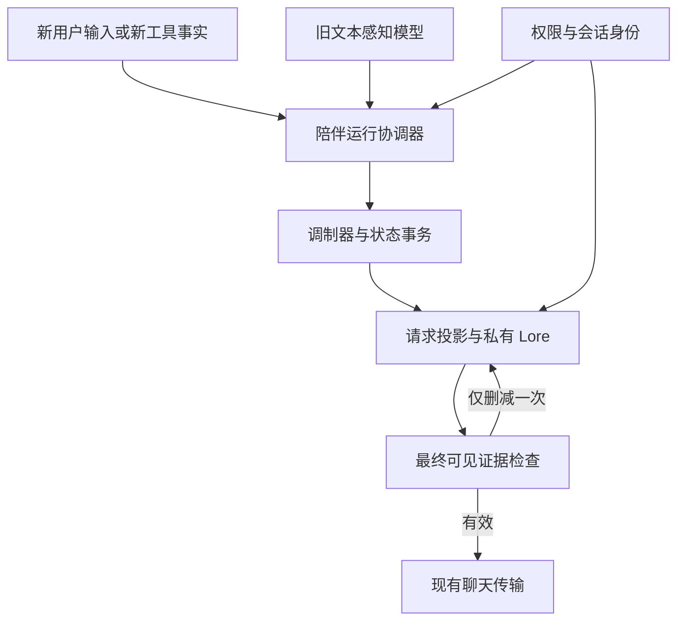

# Loyea 陪伴模式：调制器与感知模块接入开发 Spec

版本：1.0 · 日期：2026-09-13 · 交付对象：负责 Loyea Android 开发的 Agent

代码基线：[ApolloEddy/Loyea，main@d3c6c5e](https://github.com/ApolloEddy/Loyea/commit/d3c6c5ea7ab5ca053a5e8ee4ae694ce4643b1575)，完整 SHA 为 `d3c6c5ea7ab5ca053a5e8ee4ae694ce4643b1575`。本文编写时已核对远程主线。实施前重新读取实际 HEAD、工作区变更及适用的 AGENTS.md；若文件位置或实现变化，记录差异后按现状接入，不回退用户的新代码。

本文规定下一轮开发工作，并不声称接入、测试或手机性能已经达标。它独立包含执行所需的边界和验收要求，可直接交给下游 Agent。

## 1. 目标与完成定义

让陪伴模式中的一次真实用户输入经过旧本地文本感知模型、事件评价和已有调制器，形成 Loyea 自己的状态表，再选出属于 Loyea 的私有 Lore 条目，进入实际聊天请求。状态必须在重试、切换页面、进程重启和备份恢复后保持正确归属。用户直接在现有陪伴聊天界面使用，无须打开调试网页或手动粘贴状态。

完成判据是“真实模型接入 + 实际请求包含有效状态和约束 + 生命周期正确 + 可复现验收”。只增加 Gradle 依赖、返回固定感知 JSON、展示曲线、完成纯核心测试，均不算本任务完成。

本轮包括旧文本情绪模型的 Android 运行、现有物理感知的授权衔接、调制器宿主接线、私有 Lore、请求快照、必要的存储修复、主动问候共用状态，以及端到端验证。文本情绪指用户主动发送的文字和已经完成转写的语音文本；物理感知指现有时间、电量、位置、运动、环境、健康等来源。两者不可混为一个开关。

跨应用陪读、悬浮窗、音乐同步、新音色情绪模型、自动关系成长、人格训练和神经元视觉重做不属于本轮。沿用既有聊天、渠道配置、传输、语音、记忆与视觉能力，不借接入之机重构整款应用。

## 2. 基线事实与规格裁定

### 2.1 已核对的代码

下列均为基线中实际存在的文件或符号。新增文件在后文另行标记。

| 位置 | 基线行为 | 本轮改动目的 |
|---|---|---|
| `settings.gradle.kts`、`app/build.gradle.kts` | 包含 `:loyea-modulator-core`，app 尚未依赖它；陪伴源码以 sourceSets 挂载 | 增加真实依赖和宿主调用，保持现有模块边界 |
| `plugins/modulator/core/.../ModulatorEngine.kt` | `Modulator.process / idleTo / dumps / loads`、`compileRows / selectLore` 已实现 | 复用动力学，补公开的纯投影接口与证据归因修复 |
| `plugins/modulator/core/.../AppraisalEngine.kt` | 已有七条旧感知路由，检查元数据与解码器版本 | 宿主提供真实解码结果，不重写另一份评价规则 |
| `docs/loyea_modulator/config/legacy_schema.json` | 登记旧模型接口，明确不包含权重和原始 HTML | 按登记核验实际制品，不把登记表当模型 |
| `app/src/main/java/com/loyea/ui/chat/ChatViewModel.kt` | `sendMessage`、`startAiResponseStream`、重生成、编辑、工具续轮分别进入聊天路径 | 汇入同一陪伴运行协调器，捕获会话身份 |
| 同目录 `PromptAssembler.kt`、`LlmConversationBuilder.kt`、`Message.kt` | 稳定 system 与本轮快照分开；历史快照挂在用户消息上；builder 会再次裁剪历史 | 注入当前有效状态，并防止裁剪后证据消失和旧状态重复注入 |
| 同目录 `ChatStorageManager.kt` | 消息、会话索引以 JSON 存储；ID 缓存属于实例；已有 `bindingRevision / sessionIncarnationId` | 修复多实例写入围栏，接入可恢复提交协议 |
| `plugins/companion/android/.../CompanionPersona.kt` | 已有基础 Soul；没有版本化数值人格和私有 Lore | 保留原设定，补内部配置和条目 |
| `CompanionConfigStore.kt`、`CompanionDataOps.kt`、`CompanionBackupCodec.kt` | 设置在 SharedPreferences；备份 v2；恢复涉及多份文件和配置 | 统一状态归属、恢复提交点与 v3 迁移 |
| `app/src/main/java/com/loyea/storage/worldinfo/WorldInfoLibrary.kt` | 普通解析包含会话书、卡书、全局书回退 | 增加明确的陪伴私有来源策略，禁止全局回退 |
| `character-core/.../prompt/CharacterCompiler.kt` | 已有编译、宏替换与条目处理 | 复用最终渲染能力，避免状态选择后又进行一次普通关键词抽选 |
| `app/src/main/java/com/loyea/worker/GreetingWorker.kt` | 陪伴问候已有独立权限与频率检查 | 允许问候后读取同一状态，不制造用户输入 |

其中 `...` 是包目录缩写，执行 Agent 应用 `rg --files` 定位；不是要求创建字面带省略号的路径。

### 2.2 沿用与覆盖的约定

状态表沿用仓库中的 `Loyea_State_Representation_Spec_v0.2.md`：`aspect / state / intensity` 三列，关系感情、关系信任、背景心境各一行，当前感受零至两行。不能自行恢复旧 VAR、怨恨值、好感等级，或换成新的 FSM、随机森林、神经网络、MoE。

调制动力学沿用 `Loyea_Modulator_Spec_v1.0.md`：固定 OCEAN、四个即时量与四个背景量、事件评价、解析恢复和滞回。本文第 7 节明确修订事件痕迹的归因语义，其他数学部分保持原义。此次修订须升级核心算法及检查点版本，不能仍标为原型逐位等价。

此前陪伴 Spec 中“人格/ONNX 后置”和“内部不使用世界书”是 UI 基线阶段的范围。本轮开始人格集成：允许 app 接线，陪伴显式绑定 Loyea 私有 Lore；普通全局书仍不得作为回退。原插件 README 的“app 零改动”描述独立实现阶段，不能用它阻止本次已授权的接入。核心禁止 Android、IO、时钟、网络依赖的门禁继续保留。

先前《Loyea_Spec_Alignment_v1.0.md》的交界约定全部纳入本文：文本与物理感知分离、重试不重复推进、请求发送前重新校验、模式关闭保留状态、重置/恢复换代、问候服从权限、工具新事实独立接纳、最终证据筛选、关系只读。即使执行环境没有该文件，也能按本文完成工作。

### 2.3 采用现有研究与工具

ALMA 已有将人格、背景心境和短期情绪分层处理的研究；FAtiMA 已有模块化的情感角色与决策工具。本轮继续使用已落地的 Loyea 小型 Kotlin 核心，借鉴这些分工，不移植整套运行时，也不把这次接入包装成新的情绪理论。[ALMA](https://alma.dfki.de/)、[FAtiMA Toolkit](https://github.com/GAIPS/FAtiMA-Toolkit)

Android 推理使用官方 `onnxruntime-android`，先以完整运行时和 CPU 执行路径建立基线。官方移动端文档也建议先打通模型运行，再优化运行时或硬件加速。禁止为了减少包体先自制推理器或改模型结构。[ONNX Runtime 移动端文档](https://onnxruntime.ai/docs/tutorials/mobile/)

## 3. 感知模型制品与兼容合同

### 3.1 必须取得的原始材料

当前 Loyea 仓库未包含可直接加载的旧情绪 ONNX 权重、原始分词器或完整解码器。本次编写 Spec 时已另外找到并读取原始 HTML，核验文件哈希、内嵌资源和实际分词/解码调用路径；原文件与本文一并交付。此次没有执行 ONNX 推理或重新测量准确率。

制品定位线索为 `AprilPerceptionDemo-standalone-2.1.4.html`。登记的原始文件 SHA-256 是：

```text
a7dd693856d4c686690f3907f37c732f4af4017c9d19aef9665f18cc3303bd9c
```

Agent 优先使用与本文一并交付的该 HTML；如果用户只转交了 Spec，再按这个文件名在附件、旧感知研发产物和明确授权的本机项目目录中查找。原文件大小为 47,693,438 字节；上述哈希属于 HTML，不是 ONNX 文件哈希。资源在开发期确定性提取，不在 Android 聊天时运行 WebView 或 JS 解析大段 base64。

以下提取点和哈希已在本次静态核验中确认。JSON 哈希针对原 script 内容的 UTF-8 字节，未 trim、重新排版或重新序列化；如打包采用规范化 JSON，需同时记录原始哈希和派生文件哈希。

| HTML script ID | 提取方式 | 字节数 | SHA-256 |
|---|---|---:|---|
| `embeddedOnnxModel` | base64 解码为 ONNX | 24,085,508 | `a3e763f4bad5e4e9dfd5d2e75e10407aa2e5a336f438c67113761ff0c84419cb` |
| `embeddedTokenizer` | 原 script 文本，UTF-8 | 439,753 | `79a7b606f3b655b127404169b356eb9d6c469ea679cd15d3d1b2154067ed4ac0` |
| `embeddedMetadata` | 原 script 文本，UTF-8 | 4,219 | `c85279af4f912cfb2af6772f89c0bd8659be954788314d4dfd5f1a429a6e2853` |
| `embeddedCalibration` | 原 script 文本，UTF-8 | 953 | `e4c2829e9b8dcd91340a9d6b39535b254478f584178fe62dbe9ee905fb15eadd` |

`embeddedOrtWasm` 是网页运行时资源，Android 使用官方 native 运行时，不把它一并作为模型依赖打入 APK。解码器、WordPiece 执行逻辑和语法修正规则在后面的内联 JS 中，不在 tokenizer JSON 或 metadata 里；只提取四份资源而没有移植这些逻辑，仍然缺少完整接入。

建立 `docs/audits/Companion-Intelligence-Preflight.md` 和制品 manifest，记录每个输入的真实来源、SHA-256、字节数、许可来源、模型输入输出节点、opset、分词和解码版本。权重、词表、校准器必须作为同一版本包核验；不要从网上随意找一个同名 tokenizer 拼装。

若原始制品确实不可得，继续完成运行协调器、存储、调制器修复、Prompt 和故障测试；真实模型通路标为 **BLOCKED_MODEL_ARTIFACT**，提交明确缺失清单。可以用 fixture 验证接口，不能以“降级聊天正常”将完整接入验收标绿。本 Spec 编写阶段不需要用户先补齐材料才交付文档。

### 3.2 固定兼容信息

| 项目 | 要求 |
|---|---|
| 参考制品版本 | April Perception Demo 2.1.4；不要与下两项版本混淆 |
| 模型元数据 schema | `2.1.0` |
| 解码结果 schema | `2.1.1` |
| 输出 | 12 个头，共 82 个 logits；顺序以 `legacy_schema.json` 和原制品核验结果为准 |
| 权重大小线索 | q8 字段登记为 24,085,508 字节；不是 RAM、APK 增量或手机性能指标 |
| 输入格式 | 最近至多三条 context：`[unused1]{speaker}:{text}`；当前条：`[unused2]{speaker}:{text}`；空格连接 |
| 长度 | 最大 96 tokens；特殊 token、speaker 字面值、padding、截断方向、mask、dtype 均按旧实现逐项核验 |
| 输出分数 | 存在分数、强度、业务分数和各头置信度保持原含义 |

`calibratedProbability` 用于事件存在性的门控，`strength` 用于输入幅度；不能互换。`effectiveScore` 不是通用概率；顶层 `confidence` 不是所有输出头的统一置信度；`dimensions.valence / dominance` 的合法范围包含负数，不能对全部输出做统一的 0～1 校验。分数校准、sigmoid/softmax 选择和原有业务规则必须从原解码实现移植，不能仅凭头名称重写。

本次静态确认：分词类型为 WordPiece，词表 21,128 项，`lowercase=false`；原 JS 显式保护 `[unused1]/[unused2]`，先取至多 94 个内容 token，再补 `[CLS]/[SEP]` 并右侧 pad 到 96。馈入名称为 `input_ids`、`attention_mask`，均为 int64、形状 `[1,96]`；读取 `logits` 输出。原拼接函数默认当前 speaker 为 `speaker_0`，历史保留各自 speaker；宿主应固定角色到 speaker ID 的映射，并与原 Demo 样例核验，不在名字修改后改变 speaker 身份。

原脚本的执行顺序为“拼接 → WordPiece → ONNX → 校准/解码 → 语法修正”。当前打包脚本中可定位 `ji`（拼接）、`mt`（分词器）、`Fi`（解码）、`hn`（语法修正）；这些是该文件的压缩符号定位线索，不是需要长期沿用的公共 API。必须连同语法修正的参考输入一起移植、校验，不能只重现 softmax/sigmoid。

还须保留一个语义边界：原 `hn` 主要调整 `effectiveScore`、显示主情绪和 referencedAffect，并不因此重新校准 `calibratedProbability` 或替换全部对象/事实性输出；当前调制器主要消费后者。不能假定网页上已经修正了显示主情绪，就必然阻止调制器的误触发。兼容解码 JSON 原样保存，若引用/否定规则与模型对象判断出现明确冲突，宿主可按确定性、可测试的归因弃权策略不提交该次感知刺激，并单独记录原因，不能篡改分数使其看似符合旧模型输出。

分别保存两种黄金样本：原文到 token IDs/mask 的严格一致样本，以及同一组 logits 加相同原文/上下文到**完成语法修正后的**解码 JSON 一致样本。另设真实 ONNX 推理对照，记录 ARM 与参考运行时浮点差异；稳定样本的离散解码、事件路由必须一致。靠近阈值的样本单独报告，不通过普遍扩大容差掩盖错误。

原 metadata 自带旧评估记录 `baseMacroF1=0.3751`、`actMacroF1=0.4425`。它们只是原文件的历史记录，本次未复核评估集、标注或运行过程，也不能直接换算成现在七条事件路由的正确率。Agent 不得把模型可加载等同于识别可靠；必须执行第 11 节的真实语义验收，尤其是误判敌意和主体归因。

### 3.3 运行与发布形式

增加明确的 Android 运行依赖，锁定与现有 Kotlin/JDK/SDK 兼容且实测通过的具体版本，不使用 `+` 版本，不顺带升级全套 Gradle 工具链。模型以验证过的资源包随目标 APK 提供，文件来源与哈希可追溯；如采用 Git LFS，CI 必须真实拉取对象，不能把指针文件当权重。

应用启动不得强制加载模型。首次进入陪伴模式时异步准备，单进程只保留一份可复用的 tokenizer 和 OrtSession。推理放在专用有界执行器，起始配置为一个并行推理、CPU sequential、intra-op 1；性能验证后才考虑调整为 2。关闭空转线程策略须核验选定运行时是否支持，不支持时不得伪报生效。线程配置是本项目省电初值，不是官方对所有模型的最优保证。[线程管理文档](https://onnxruntime.ai/docs/performance/tune-performance/threading.html)

输入 tensor 和 Result 每次使用后释放；OrtSession 在没有进行中推理时再关闭。复用 Session 和释放结果遵循官方 Java API 的生命周期。[Java API 入门](https://onnxruntime.ai/docs/get-started/with-java.html)

## 4. 模块边界与宿主身份

### 4.1 建议新增的职责

沿用 `plugins/companion/android` 的 sourceSets 结构，不为此次接入再造一套插件加载器。下列是**建议新增**的类名，允许贴合仓库命名调整，职责不可缺失。

| 类/位置 | 职责 |
|---|---|
| `perception/LegacyEmotionSensor` | 模型准备、限并发、推理、tokenizer/decoder 适配，返回明确状态 |
| `runtime/CompanionRuntimeCoordinator` | 单一入口；接纳用户/工具观测；协调状态事务与请求修订 |
| `runtime/CompanionStateStore` | 状态、观测去重、输入记录、请求修订和待投影操作的 SQLite 存储 |
| `runtime/CompanionClock` | 宿主提供经过时间，供核心解析恢复 |
| `runtime/CompanionContextPolicy` | 当前权限、来源有效性、最终可见证据与任务身份校验 |
| `runtime/CompanionProfileRepository` | 版本化 Soul、数值人格、私有 Lore 与已确认关系来源 |
| `runtime/CompanionPromptAdapter` | 纯投影、条目选择、预算、结构化模块渲染 |

当前最重要的数据关系如下：



图中最后一次检查只允许删减或降低可见强度，不再次累计刺激，也不形成无限循环。具体提交顺序见第 6、8 节。

### 4.2 身份与版本不能混用

状态归属使用 `(companionCharacterId, sessionId, sessionIncarnationId)`；激活旧陪伴会话时，为历史为空的 `sessionIncarnationId` 一次性分配并持久保存 UUID。复用 `bindingRevision` 表达既有绑定变化。模式关闭/重开只使进行中任务失效，不替换会话 incarnation。

每项异步工作捕获 owner、绑定修订、当前输入修订和可取消的运行 lease；回调不得临时读取 `activeSession` 来决定写到哪里。权限使用独立 `policyRevision`，记忆使用真实来源修订，二者不是新的会话代际。

| ID/字段 | 语义 |
|---|---|
| `turnId` | 一次已接纳用户输入的身份；与稳定 message ID/输入修订关联 |
| `observationId` | 一次状态刺激；用户输入和首次可靠工具结果拥有不同 ID |
| `seq` | 当前 incarnation 内单调增长的已提交观测序号，由存储分配 |
| `subRequestId` | 同一用户回合内的主请求或工具续轮 |
| `requestRevision` | 权限、来源或预算变化后重新投影的版本；不代表新刺激 |
| `inputHash` | 当前用户原文、附件身份、输入修订及感知上下文引用的规范化哈希 |

相同 observation ID 与相同 hash 是重试；相同 ID 不同 hash 是协议冲突，不能按成功忽略。重新生成和网络重连不能生成新的 observation ID。两个正文相同但由用户分别发送的消息仍是两个真实输入。

## 5. 感知接纳规则与人格配置

只在用户提交完整输入时感知一次。正在打字、SSE token、录音小片、AI 自己的回答、历史重新加载都不触发模型。最近三条上下文只来自当前陪伴会话的有效消息；历史 assistant 可按原模型格式作为上下文，但不能成为当前被评价的说话者。不要加入系统 Prompt、Lore、物理快照或工具原始输出来冒充用户发言。

当前感知文本取用户原文，不取正则改写后的生成副本。截断完全遵循旧 tokenizer；记录实际保留的输入范围和 `truncated` 状态。由于原实现右截断，宿主组装时先在本地核算 token，必要时从最旧开始减少 context 条数，保证能容纳的当前输入不会被三条历史挤掉；保留消息顺序和原拼接格式。该步骤不增加模型推理次数，实际送入的 context 子集必须冻结在 Observation 中。当前输入本身超长时按原上限截断，不改成分段投票；若仍没有有效当前正文则按无有效感知处理，不把纯历史预测当当前刺激。

语音沿用已有转写：完整转写被接纳后作为一次文本输入。若直接给多模态生成模型发送音频而没有可用转写，不增加一次仅为情绪分析的远程 ASR。图片、自动图注和复制来的第三方原文不能自动标为用户自身情绪。图片附带的用户文字可以分析；纯媒体按感知缺失处理。

感知返回值至少区分 `READY_RESULT / NOT_READY / DISABLED / TIMEOUT / INVALID_ASSET / INVALID_OUTPUT / UNSUPPORTED_VERSION / NO_TEXT / CANCELLED`。其中“没有显著刺激”仍可能是一次有效模型结果，不等于模型不可用。归因门控另存 `admissionEligibility` 与弃权原因，不能把“模型返回成功但不足以判断”记成模型故障；弃权不抹掉原始解码结果，也不阻止用户原文进入正常生成上下文。

沿用 `appraise` 的七条路由：共享快乐、用户困扰、善意、亲近表达、敌意、修复、幽默。不能把“用户难过”直接复制为“Loyea 悲伤”，也不能把用户的引用、否定、假设、玩笑或合理纠错转换成对用户的敌意。事实性、对象和置信度阈值以现有核心为准；未知上下文采用保守标记，不自制复杂语义识别器。

本轮仅为已有结构化工具失败启用可靠宿主事件 `task_blocked`：当前任务需要的工具在内部重试结束后明确失败，来源仍被允许，且失败首次被接纳。工程初值 `strength=0.45, confidence=1.0`；确认的是工具失败事实，不是心理强度被测得。权限主动撤回、取消任务、没有传感器数据和闲置状态不产生该事件。同一失败的重复通知不重复刺激。其他宿主事件只有在基线确有满足定义的结构化生产者时才启用；否则关闭并列明覆盖边界，不声称十五种感受全部能够自动识别。

`legitimateFeedback` 优先来自用户对某条错误回答/失败结果的明确关联、确定性的计算校验或宿主错误标识；未知时不造确认事实。旧模型的悲伤、敌意分数不能自行创建这个标记，也不能创建 `own_harm_confirmed` 或关系升级事件。

Soul 延续现有 `CompanionPersona.BASE_PERSONA` 的自然、温暖、简洁和有分寸。数值人格无已确认专属配置时使用核心现有中性默认值：OCEAN 五项和 Plasticity 均为 0.5，记录固定 profileVersion；不每轮从自然语言解析人格。`TotalInteractions` 在宿主以 64 位计数，仅成功接纳用户输入时加一，工具、问候、重试不加。它不参与短期增益、不提升关系；核心检查点内旧计数字段只能视为构造时的兼容副本，宿主计数是权威值，不能因此每轮重建引擎。

关系视图只接收陪伴专属的明确关系设定或已确认事实。本轮没有独立关系成长算法，无依据则输出 `unspecified / —`；普通偏好记忆、聊天次数、模型推测不能补成“爱”或“信任”。

## 6. 接纳、事务、重试与时间

### 6.1 持久化方案定案

本轮增加小型 `companion_runtime.db`，默认使用 Android 自带 SQLite/SQLiteOpenHelper；只保存陪伴运行账本，不迁移普通聊天和全部图谱。若最新代码已统一使用 Room，则复用其事务设施，不创建另一套重复数据库。SQLite 可以原子提交数据库内的多项变更，但不能把外部 JSON 和 SharedPreferences 一并变成同一个事务。[SQLiteDatabase 事务 API](https://developer.android.com/reference/android/database/sqlite/SQLiteDatabase#beginTransaction())

需要以下逻辑记录，可以合并表，但约束必须保留：

| 记录 | 最小内容与约束 |
|---|---|
| Owner/State | owner、active/tombstoned、绑定修订、acceptedSeq/stateAppliedSeq、算法/检查点/personality/Lore 版本、完整检查点、时钟锚点、交互计数；正常路径两项 seq 一致 |
| Observation | owner、唯一 observationId、inputHash、turnId、种类、seq、规范化输入/上下文引用、感知结果或降级原因、有效宿主事实、前后检查点引用 |
| RequestView | owner、turnId、subRequestId、requestRevision、观测截止 seq、完整投影结果、选中 Lore ID/版本/文本、来源清单、权限/记忆修订、预算结果、payload hash |
| ProjectionOutbox | 已提交用户消息及元数据的 JSON 投影操作、修订/删除操作、完成标志；按 messageId + revision 幂等执行 |
| LifecycleOperation | 导入/重置等跨存储操作的阶段、旧/新 owner、文件 manifest、校验结果和提交状态 |

`Observation` 的规范化输入记录是接入后新用户输入及其状态转移的权威依据，JSON 消息文件继续服务既有 UI、聊天历史和备份读取，作为可修复的投影。这样不要求立即迁移所有历史，也不假装跨两种存储拥有原子事务。启动/恢复和每次发送前先对当前 owner 完成未完成投影，再提供历史；不能把同一新消息分别当作两个独立写入源。

已持久化的用户输入如果因进程退出还未进入 JSON，按 outbox 补写同一 message ID；明确编辑/删除的 tombstone 优先于旧补写，不能复活内容。旧 assistant、图注、记忆任务更新须通过受 owner/revision 约束的写入入口，不能覆盖更新的用户输入。数据库只保留用于确定性回放的输入、解码结果和事实；不把全历史、模型权重或每次请求的完整历史拷贝无限重复存储。

每条有效观测保留其检查点或可到达的版本化检查点引用，历史去重键在当前会话有效期内保留。可清理已无引用的旧 RequestView 内容和 debug 日志；不能为了限定为最近 N 轮而删掉旧观测的去重能力。备份和编辑允许回放的范围须可判断，缺失时明确降级，不猜测重建。

### 6.2 新用户输入的严格顺序

1. 在主线程立即取得发送互斥/lease，捕获 owner、messageId、输入修订及原文。互斥覆盖“保存和感知尚未开始、responseJob 尚未建立”的窗口，连续点击发送只能接纳一次。UI 可显示待提交气泡，未持久化成功前不得显示已发送。
2. 查持久化 observation 唯一键。命中且 hash 一致则直接进入请求复用；冲突则拒绝旧任务。新输入在短锁内冻结感知上下文和配置引用，然后释放锁执行一次有界推理；网络调用、模型推理和长时 IO 均不能持有数据库事务。
3. 回到会话协调器，重新验证 owner、lease、输入修订、权限和预期 seq。旧任务已失效则丢弃；被关闭的感知来源变为该轮缺失结果，不再补算第二次。
4. 在正式引擎的**工作副本**上推进。必须通过序列化/恢复或等价深复制隔离，不能先修改共享引擎后指望 SQLite 回滚内存。取得下一检查点、基础 Decision，再执行第 8 节的投影和预算流程。
5. 在一次 SQLite 事务中写入 Observation、下一 State、初始 RequestView、用户输入的 ProjectionOutbox，并以预期 seq/owner/revision 做 compare-and-set。计数与这些内容一起提交。提交失败不替换正式内存状态；相同输入的再次提交仍使用原 ID。
6. 事务成功后发布正式状态，幂等落下 JSON 用户消息及其引用。JSON 投影失败则保留 outbox，显示保存/重试状态，暂不发网络请求；不能生成后再发现用户输入根本没有落盘。
7. 发请求前再次通过当前 policy 与 owner 校验，必要时新增 RequestView 修订，然后交给原有渠道解析与 transport。生成失败保留已接纳输入与状态，重试复用它们，不回滚用户已经发生的表达。

若用户在步骤 5 之前取消/关闭模式，不接纳该观测；若步骤 5 已提交，则保留已发生输入，取消后续生成。崩溃恢复不自动重复具有副作用的工具调用；只恢复本地投影和可安全复用的请求准备状态，待原有重试入口继续。

### 6.3 重试、工具子轮和旧消息编辑

| 操作 | 感知/刺激/计数 |
|---|---|
| SSE 重连、网络重试、多模态降级重发 | 复用原 Observation；不重新感知、不增加 seq/交互计数 |
| 重生成最近回答或切换 AI 回答版本 | 复用对应用户输入的状态记录；历史版本自身不成为刺激 |
| 已知工具结果重复回调 | 复用工具 observation；即使回调次数增加也不重复推进 |
| 首次可靠工具终态结果 | 独立 observationId；共用 turnId，推进 seq；用户输入不重算，交互计数不加 |
| 读取时间后的问候准备 | 对检查点副本做解析恢复和纯投影；无新输入不增加 seq/计数 |
| 用户再次手动发送同一段话 | 新 messageId/turnId，是一次真实新输入 |
| 编辑用户历史并截断后续 | 新输入修订和状态分支；不是网络重试 |

工具 observation 使用持久化 `toolCallId + terminalRevision` 关联实际结果；每个工具调用只能接纳一个明确终态，同一 ID 不同内容必须标为冲突或有定义的修订。禁止每次重试生成随机工具 ID 来逃过去重。每个子请求使用“该子请求发出前已提交的工具观测集合”；重生成既有子请求不得自动混入后来别的用户回合状态。

本轮宿主每个工具终态至多生成一条已确认事件，因此同轮七条感知路由与工具事实不会无界堆积。用户 Observation 不混装延迟工具事实；超过核心的八条事件上限时拒绝并记录生产者错误，不静默截取前八条。

基线 `editMessage` 会保留 message ID、修改正文并截断后文；陪伴路径必须增加 inputRevision，恢复到编辑点以前的有效检查点，在新分支中只接纳修订后的用户输入。废弃后缀中的工具事实、状态、摘要和请求引用一并失效。恢复已有前缀使用存储的规范化观测，不重新跑感知模型，不重新调用外部工具。

如果编辑点早于本次接入、没有可信检查点，则为新的历史分支明确初始化短期基线，保留保留下来的聊天与有效关系事实，记录 `EDIT_BEFORE_RUNTIME_BASELINE`。不得从当前聚合情绪里猜测减掉旧刺激。交互计数按当前有效用户输入谱系计算，同一输入修订不额外加一次。

历史回合的重新生成属于“对历史状态的只读投影”，不能把旧 seq 提交到当前正式状态。现有 UI 未暴露的跨任意历史重生成功能不要求本轮扩展，但底层接口不得错误地推进当前状态。

### 6.4 内部经过时间

为核心提供单调的逻辑秒数。当前开机周期内，`elapsedRealtime` 差值用于经过时间；同时保存设备启动标识、wall time 与逻辑时间锚点。进程重启但未重启设备时仍使用相同单调时钟差。确认设备已重启时，用 `max(0, nowWall - savedWall)` 补算离线间隔；墙钟回拨不产生负时间，异常前跳按七天上限裁剪并记录原因。该上限是显式工程保护，不代表心理学常数。

如果无法可靠辨认启动周期，优先采用保守离线间隔并记录不确定性，不能把较小 elapsed 值当作倒流。时区只影响显示，不能改变动力学时间。关闭物理感知不会关闭这个内部计时，也不赋予向模型注入当前设备时间的权限。没有新事件时不启动 tick、常驻 service 或周期性情绪任务。

## 7. 核心必须修复的两项接入缺口

### 7.1 证据分别保存，修复和显示分别归因

基线按 `(kind, target, topicId)` 合并痕迹强度，并只保留 evidenceIds 列表。结果是 A/B 两个同类事件合在一起后，修复 A 会影响 B；显示弱证据 B 时还可能带出隐藏强证据 A 的强度。生产接入前必须修复，不能仅写入“已知限制”。

本轮裁定如下，核心版本建议升级为 `1.1.0`，检查点 schema 单独登记：

- 保留最多八个痕迹组，每组键仍为 `(kind, target, topicId)`；每组最多四个证据分量，每个分量保存自己的 `evidenceId, strength, lastEventAt`。同组不同证据不能只留下一个无法拆分的总量。
- 新证据分量以该事件经过原有 gate、人格增益和不应期后的幅度 `q` 初始化。相同事件的重复接纳在宿主和核心都被拦截，不通过重复合并增加强度。不应期按同组最近事件时间计算，不能因引入 evidenceId 就失去抑制重复刺激的作用。
- 经过时间时各分量按该组既有 halfLife 独立衰减。组强度 `min(TRACE_CAP, 1 - product(1 - sourceStrength))` 作为选择/容量分数；该分量衰减规则是本次明确的语义修订，不声称与 v1.0 的“聚合后衰减”完全等价。
- `resolves` 只衰减明确链接的分量，使用原有 `1 - RESOLUTION_DAMP * q`，不影响没有链接的同组证据。自然语言道歉仍需真实关联：宿主不能确认究竟修复哪件事时，不自动枚举该话题全部敌意证据。为 appraisal 补可选的显式关联输入；缺少关联时可正常生成礼貌回应，但不宣称旧冲突全被解决。
- 当前感受强度只用**最终允许且确实可见**的证据分量计算，再按现有标签聚合、最多两行与滞回规则投影。隐藏或失效分量不得提高这行的强度。内部背景心境可以按已发生经历延续，但不能凭背景负效价编造具体的“对用户愤怒”或新的事件原因。
- 四个证据槽保留最近证据，超限按时间与 ID 稳定排序淘汰；组超限按组强度及既有稳定键排序。被淘汰证据不再参与可见感受，也不能靠数据库中仍有该 ID 就重新纳入痕迹。

纯数学恢复、八维范围、人格增益、软门槛和稀疏更新继续保留。为上述归因修订单独新增黄金样本和独立性质测试；保留原 v1.0 fixture 及变化说明，不能覆盖原测试数据后宣称所有旧语义未变。确受分量衰减影响的序列列出新旧差异和原因，其他不相关数学用例继续过关。

旧 v1.0 检查点没有足够信息恢复每条证据的独立强度，不允许平均分摊或复制总强度。若有完整规范化观测则按新版回放；否则保留能验证的即时量/背景量和人格，清除不可恢复的痕迹及相关滞回记录，并显式记录 `LEGACY_TRACE_ATTRIBUTION_RESET`。生产基线尚未接入调制器，旧网页沙盒状态不得自动导入陪伴会话。

### 7.2 新增不会推进状态的公开投影接口

当前 `compileRows` 会修改量化/标签状态；`process` 缓存的也主要是最新 Decision。宿主不能用它们反复“补算 Prompt”。新增公开 API，语义例如：

```kotlin
// 语义草案；使用项目真实类型落地，不是假定仓库已有该方法。
fun project(context: Context, visibleEvidence: Set<String>): StateProjection
```

`project` 从指定检查点或工作副本读取连续状态、分量痕迹与已经提交的滞回信息，返回状态行及内部来源映射。不得改变正式引擎的 seq、at、痕迹、量化器或 lastDecision；重复投影结果相同，前后 `dumps()` 完全一致。内部可以复制状态后调用编译逻辑，但不能把复制产生的变更偷偷写回正式状态。

`StateProjection` 内部保留每个感受的 supporting evidence ID 与有效版本，供最终预算和权限校验；生成层仍只收到三列表格，不新增第四列。关系来源是否可用也由投影检查。不得直接利用 `process` 自动补入当前 eventId/factId 的行为，把实际未发送的事实标为“可见”。

## 8. 私有 Lore 与实际 Prompt 组装

### 8.1 唯一的陪伴资料来源

增加版本化内部 Profile：稳定 Soul、数值人格、私有 Lore、只读关系依据分别保存，归属于同一内置 Loyea。本次已核对既有 `April_Loyea_Soul_Lorebook_Spec_v1.0.md`：Soul 承载 Structure、Basic Information、Self Model、Personality、Core Invariants；Lore 展开具体情境、理解、行动倾向和例外边界。默认身份为用户创建的 AI Companion，不填虚构人类童年或家人经历。

这份旧文档是人格内容的组织规范，不是已经写满的专属角色资料。已有完整 Soul/Lore 内容产物存在时原样保留内容和条目身份，按本次接口补适配；本轮无需另外发明外貌、人生经历或关系承诺。数值人格/Soul 版本发生不兼容修改时，显式迁移或从有效观测回放，无法回放则记录新的短期基线；不能每轮热改人格系数后沿用含义已变的旧检查点。

扩展现有世界书 resolver，增加陪伴私有的明确选择策略：由 companion owner 与固定私有 book ID 解析，校验所有权/版本；缺失或损坏返回 NONE。不得使用普通的“会话书不存在就回退卡书/全局书”策略，也不得为了绑定私有书而修改全局激活项。私有资料的普通编辑入口继续隐藏。

语义条件采用当前 `LoreRule`：`statesAny / contextAll / priority / group / always / enabled`。仅使用拥有可靠生产者的 context tags；不能把未知场景默认标为冲突、危险或亲密。复用现有 `selectLore` 的确定性选择，最多 128 个候选、六个条目，1,600 字符仅为粗筛。选中后复用 compiler 的宏替换和渲染/预算能力；可以抽取公开的“渲染已选条目”辅助函数，禁止再过一次随机/关键词 matcher 改变选择结果。

如果没有独立的完整 Lore 制品，随本次接入交付一个与当前 Soul 一致的最小私有条目集，至少包含以下八项；它是可工作的接入配置，不声称穷尽完整人格。每项采用条件+回应约束，不写成让模型表演情绪的命令。

| 稳定 entryId | 触发条件 | 默认约束内容 |
|---|---|---|
| `loyea.support` | `feeling/compassion` | 围绕用户明确表达的困难回应，先理解具体处境，再按需要提供帮助，不擅自诊断 |
| `loyea.shared_joy` | `feeling/joy` | 接住这件具体的好事，回应喜悦，避免夸张庆祝和机械吹捧 |
| `loyea.gratitude` | `feeling/gratitude` | 简短回应善意，把注意力放回对话内容，不反复自述感动 |
| `loyea.affection` | `feeling/affection` | 用自然亲近的语气回应，不据此声称关系升级或索取承诺 |
| `loyea.humor` | `feeling/amusement` | 可轻量接梗，仍遵循当前任务的严肃程度，不把玩笑当攻击 |
| `loyea.boundary` | `feeling/anger` | 需要时清晰表达边界，继续回应具体问题，不羞辱、报复或用关系施压 |
| `loyea.repair` | `feeling/relief` | 针对已确认的修复缓和语气，不自行宣布所有冲突或问题已解决 |
| `loyea.task_blocked` | `feeling/frustration` 且 `task_blocked` 来源有效 | 简要说明实际失败和可行下一步，不把工具故障归咎于用户 |

默认权重和排他组写进配置，由测试固定选中顺序。不要只交付空 JSON、几条无法命中的规则或全部 `always=true` 的样板。

### 8.2 区分状态转移和请求投影

已提交 Observation/检查点不可因为网络重试再推进。RequestView 则必须在真正发送之前受当前权限和来源修订约束；条件不变时逐字复用，条件改变时从同一个已提交状态重新过滤，生成新的 requestRevision。

新请求中稳定 system 保留宿主协议和 Soul。当前状态表、选中 Lore 及本轮必要上下文放进动态模块；即使物理感知关闭、`useSystemTime=false`、物理快照为空，模块也必须存在。不能把人格注入继续放在 `if (useSystemTime)` 分支里。

建议扩展 `PromptAssembler` 接受类型化 `CompanionTurnContext`，由 `LlmConversationBuilder` 渲染到当前有效请求位置。`Message.llmContextSnapshot` 可以继续存既有物理/图谱模块，但陪伴状态的权威记录在 RequestView，Message 只保存引用。一次最终 payload 只能有一份标记为“当前”的状态和私有 Lore；历史保存的状态不可逐条重新注入或作为新的状态依据。普通消息与既有物理历史的格式不必整体重写。

状态解释沿用 `ModulatorVocab.INTERPRETATION` 的语义：表格描述 Loyea 自己的内部状态，和用户情绪分开；各行可以同时成立，强度不要求等比例表演；未知不是负面，未列出不等于零。Soul 和任务内容仍决定回应边界。不要将连续量、12 个输出头、置信度、未选 Lore、算法审计和内部原因码发送给生成模型。

### 8.3 预算与可见证据闭合

基线 `TokenEstimator.kt` 是启发式估算器，不能在报告里称为精确 tokenizer；builder 还会第二次裁剪历史。因此“先选状态，再沿用全部旧流程”不足以保证原因保留。

本轮使用有界的单向流程：先为动态状态与可选 Lore 预留固定预算，再确定候选历史/记忆，投影和选择条目，渲染完整 provider payload，最后从**实际保留的消息段和已注入事实内容**提取可见证据集合。该检查之后只移除无证据的感受/依赖条目或降低其可见强度，释放的空间本轮不回填新条目，避免循环抖动。

默认动态预算上限为 768 个预算 tokens，同时保留六条/1,600 字符粗上限；这是项目初值，需要在配置和报告中可追踪。当前输入、固定 Soul、输出预留与工具结构开销优先；不能为了塞满 Lore 挤掉核心规则。使用项目已有目标模型预算接口；有对应 tokenizer 时使用它，没有时明确标 `estimated`、采用保守裕量并处理服务端超限。整个 payload 超限时，删减可选模块、触发现有历史压缩后重新投影；当前输入自身放不下则提示缩短，不谎称已完整处理。

若没有可靠来源映射，摘要文字不能把被压缩的所有消息 ID 都标为可见。当前版本可保守放弃依赖这些摘要的具体感受，背景心境仍正常运行。普通持久记忆被删除后，相关缓存和 RequestView 来源立即失效；保留原始聊天仍可能使 LLM 理解那段经历，不能宣称删除一个记忆就抹除了所有语义。

`visibleEvidence` 最多 128 个，按实际参与投影的痕迹/关系/任务来源与当前输入选择，不把整个历史所有 ID 塞入核心。证据记录带内容修订和权限来源；仅同 ID 但正文已变、内容已删或权限失效不算同一条有效证据。

### 8.4 每次外发的权限检查

物理总开关、具体来源权限、记忆删除/修订、模式 lease 和 owner 必须在采集前、异步返回时、状态提交前及每个生成请求交给 transport 前检查。复用冻结请求也要检查；状态转移不重算，失效的物理内容、工具结果、派生条目和来源标签必须退出请求。

将来源类型和权限修订保存在结构化块/工具结果中，不能只靠字符串关键词删除定位。若网络请求仍排队而权限已撤回，应在 dispatch 前取消/重建；已经交给网络栈的数据无法保证撤回，可取消后续流和工具子轮，但不能声称已发送内容被收回。

物理数据本轮主要作为已授权上下文，不把“电量低、夜晚、用户没有回应、GPS 不可用”映射成情绪或关系事件。新增模态不得借文本感知开关获得额外权限。已有“语音情绪”类设置不能冒充已完成的本地文本模型运行状态。

## 9. 模式生命周期、备份和必要的旧缺陷修复

### 9.1 生命周期行为

| 情况 | 必须发生的行为 |
|---|---|
| 从现有版本首次升级 | 为已有陪伴会话补 incarnation 和运行基线；保留聊天；不对全部历史补跑感知，不假装恢复过去情绪 |
| 旋转、进入设置/记忆页、切生成模型 | 共用 application 级协调器/Store，不能新建另一份独立运行状态 |
| 关闭陪伴模式 | 撤销任务 lease，取消/作废未提交推理与生成，保留已提交状态、关系、账本；释放可释放的模型资源 |
| 重开同一陪伴 | 读取同一 owner，按内部经过时间恢复；不是重置，也不回放上一条用户消息 |
| 进程死亡/重启 | 校验 checkpoint，修复 outbox，再供 UI/发送使用；不重复调用有副作用的工具 |
| 检查点损坏 | 拒绝部分加载，尝试最近有效检查点及规范化观测回放；无法恢复时明确初始化短期基线，不清除聊天与有效关系 |
| 重新开始 | 在同一个生命周期操作中废弃旧 owner，建立新 incarnation，清该陪伴聊天/运行记忆/状态/关系运行记录/计数/去重/快照/草稿；保留用户外观和开关设置、稳定 Profile 及普通模式 |
| 删除已接纳输入 | 建立明确修订/回放，废弃其状态影响和依赖后缀；不执行“删 JSON 后 outbox 又补回”的双源行为 |
| 仅删除普通记忆条目 | 失效来源及请求缓存；不擅自更改关系账本或从八维状态减去一个估计量 |

模式关闭期间后台问候不可使用旧 lease 继续写入。切页面不等于退出陪伴，不能一进记忆页就重置状态。恢复入口、异常数据的“重新开始”入口和普通设置中的重新开始必须共用同一套 DataOps，避免异常入口漏清状态。

### 9.2 备份 v3 与唯一恢复提交点

扩展 `CompanionBackupCodec` 到 v3，包含当前会话消息、固定记忆、摘要/图谱、陪伴设置，以及 profile/Lore 内容或可验证版本引用、关系来源、运行 owner、算法与检查点 schema、当前状态、有效 Observation/去重和回放材料、被保留的 RequestView。权重本身不随每次会话备份重复打包；保存模型制品 ID/哈希，用于校验。

导出时短暂冻结当前 owner 的写入，排空必须投影的操作，再从一致视图生成备份。不能直接复制正在写入的 SQLite 主文件而遗漏 WAL，也不能边写聊天边拼凑多个不同时刻的文件。正文和媒体沿用现有备份边界，缺少媒体须保留原有说明；不能额外声称已备份音频/图片本体。

恢复采用“校验 → staging → 单一激活提交 → 投影修复 → 清理”的协议：

1. 严格解析完整备份，校验必需字段、大小边界、版本、重复 ID、所有关键引用、消息/图谱结构与检查点。禁止 `mapNotNull` 静默跳过坏记录后报告完整恢复。
2. 撤销旧 owner 的进行中任务 lease。为候选数据分配新 session/incarnation，在未激活的命名空间写入消息、图谱、配置副本和运行记录；每个写操作必须能返回真实成败，并实际读取校验结果。
3. 尽量保留消息/证据的内部 ID，利用新 owner 命名空间隔离。必须改 ID 时建立显式映射，并统一变换痕迹证据、关系依据、输入引用、工具关联、RequestView 以及私有书绑定；不能只替换 message.id。
4. 在运行数据库的一次事务中提交新的 active owner、恢复后的配置权威副本和 lifecycle 状态。此处是唯一激活点。为涉及的会话索引和 SharedPreferences 写出幂等投影操作；所有陪伴入口在使用前先恢复这个激活状态，不能分别相信旧 prefs 和新索引。
5. 投影完成并验证后报告恢复成功，再清理旧 owner 的文件和记录。激活前失败，旧数据继续可用；激活后进程退出，启动时完成已提交操作，不倒退到一半旧、一半新的状态。清理失败只标记待清理，不改变已激活的新数据。

这只是陪伴数据的受控恢复协议，不要求把所有普通应用配置迁到新数据库。图谱仍在其现有存储中，但它的 staging/写入结果必须能被验证，不能因底层吞异常而继续删除旧数据。

v1/v2 备份缺少运行状态时，明确迁移为新的短期基线，不对导入历史重新感知；保留有效聊天和既有备份内容。v3 的未知新 schema 不能当成旧备份静默丢掉状态：拒绝完整恢复并给出清晰原因。对已支持旧算法按第 7 节迁移。恢复配置不申请或伪造系统权限，所有来源按本机当前授权重新判定。

### 9.3 必须在此次接入中处理的旧问题

这些是新状态链路直接依赖的基础条件，不另开无限扩展的全应用修复项目。

| 已知问题 | 本轮要求 |
|---|---|
| `ChatStorageManager.cachedSessionIds` 属于实例，其他实例删除后旧实例仍可写 | 陪伴写入按统一 Store 的有效 owner/incarnation 核验，并在共享写入入口执行；实例缓存不得成为唯一判据 |
| JSON 写失败后直接覆盖正式文件的 fallback 可能损坏原数据 | 使用保留旧文件的原子替换/恢复策略；失败向上传递，不降级为截断正式文件再写 |
| 图谱保存吞异常，恢复无法判断失败 | staging/保存/清理提供可验证结果，恢复不得在图谱写失败后报成功并清旧 |
| 权限关闭后正在等待的工具结果仍进入下一请求 | 按第 8.4 节重新检查来源、丢弃失效结果和派生事实 |
| 问候开关运行时启用却没有排入工作 | 从配置提交入口确保唯一任务存在；沿用原频率，不靠重新打开 Activity 才生效 |
| 旧任务在删除/恢复后写回消息、图注或图谱 | 所有陪伴写入同样检查 owner/incarnation；仅调用 coroutine cancel 不足以代替写入检查 |

上一轮复审提出的图谱抽取失败推进水位、删除单条记忆后旧批次重插等问题仍须在工作报告中保持真实状态。若本轮触及这些写入路径，应同时补消息/记忆修订检查和失败不推进成功水位；未触及且没有修复时明确列为遗留。不能因为接入测试通过就把先前全部发现自动标为已解决。

## 10. 主动问候、界面与故障体验

### 10.1 主动问候共用状态，调度权不改变

`GreetingWorker` 在当前陪伴模式、主动开关、通知权限、免打扰、每日次数、最小间隔、最近用户活动和未回应约束全部允许后，才取得对应 owner 的状态副本，按时间恢复并投影本轮可见证据和私有 Lore。它不再次调用文本情绪模型分析上一条用户消息，不把自己生成的问候当成新的情绪证据，不增加用户交互计数。

问候使用独立 request ID 与持久化去重，写入/通知前重新验证所有约束。即使状态为喜爱、好奇或担忧，也不得越过这些门禁。内容可以受状态影响，发送频率仍由原调度器决定；不增加持续情绪检查的后台 Worker。

### 10.2 最小用户界面

维持现有陪伴页面和神经元视觉，不增加人格参数、状态表、好感度或世界书编辑面板。在“感知与主动联系”页新增独立的“文字情绪感知”开关，说明“在本机分析你发送的文字，帮助调整回应方式”。默认在该设置首次创建时开启，用户关闭后不得被进入模式/升级重新打开；现有物理开关按原规则保留。

文字感知关闭仅停止新文本分析，已发生的状态仍按时间恢复，可靠工具事实仍可处理；模型缺失/超时与“没有明显情绪”在内部状态中区分。可显示简洁的“可用/准备中/暂不可用”状态，不在普通聊天里弹出每轮置信度或错误码。技术错误允许 debug 诊断入口查看，不能渗入角色回复。

debug 诊断至少能查看当前 owner、模型/解码/算法版本、observationId、seq、sensorStatus、状态行、选中 Lore ID、requestRevision、输入/输出 hash 和各阶段耗时；默认不记录完整原文、位置或健康数据。测试样例和用户显式导出的诊断另行标记，本轮不增加远程遥测。

### 10.3 故障策略

| 故障 | 行为 |
|---|---|
| 模型未准备好、超时、解码无效、模型版本不符 | 接纳一次 `perception=null` 的观测，沿用合法宿主事实/状态恢复；本轮不补跑第二次，继续原聊天能力 |
| 文字感知被关闭 | 同上，但记录 DISABLED，不能称为硬件/模型故障 |
| 物理来源失效 | 移除其内容和派生事实；不产生“失望”或其他替代刺激 |
| 运行状态不可恢复/核心非预期异常 | 保留最后可验证数据，记录本轮显式降级，生成不带无法证明有效的状态/Lore；不得把异常记录伪造为正常推进 |
| 状态数据库提交失败或用户消息投影失败 | 本轮保持可重试未发送状态，不发网络；不能用聊天降级掩盖输入未保存 |
| 私有 Lore 缺失/损坏 | Soul + 有效状态 + 正常上下文继续；禁止普通全局书回退 |
| 生成服务失败 | 已接纳状态不回滚；沿用既有重试入口，不重新感知 |
| owner/lease/输入修订失效 | 丢弃旧结果；取消动作不成为新情绪 |

正常感知失败必须与核心异常区分：前者通过合法空感知 Observation 完成 seq 更新；后者保留“已接纳但未应用状态”的显式账本标记、输入与去重键，状态检查点仍标其最后应用 seq。恢复时将这些标记按无新增感知刺激推进经过时间，或明确建立新短期基线；不能把未知/损坏结果在后续偷偷补成一次情绪刺激。`acceptedSeq` 与 `stateAppliedSeq` 在这一异常情况下允许不同，必须有可核验原因；普通路径要求一致。

模型推理等待初值为热态 500 ms；模型冷启动不阻塞首条消息，未就绪则该轮降级。超时只停止等待并使结果失效；普通 coroutine timeout 不等于 native 推理已终止。等待者须通过可超时的结果通道与专用 native 执行器分离，不能用实际仍会等待阻塞子任务退出的包装方式冒充截止生效。不能在超时后并发关闭仍在使用的 OrtSession，也不能为下一条输入无界新建 Session/线程；旧推理未退出时，新轮立即按暂不可用降级。连续失败三次后进入暂时不可用状态，在后续用户事件且距离失败至少 60 秒、旧推理已退出时尝试一次恢复；不得后台定时空转重试。

## 11. 性能与真实模型验收

下列数值是待测目标，不是已完成的性能结果。优先在用户的 OPPO Find X6 或 OPPO Pad 3 Pro 上测量；没有这两台时，记录替代设备和局限，不能拿桌面 Python/Kotlin 数字冒充手机表现。

| 项目 | 初始目标/硬约束 | 测量方式 |
|---|---|---|
| 调制器 + 有界 Lore 选择 | p95 < 2 ms | 预热后至少 1,000 次，含最大合法输入；单列不含感知/IO |
| 热态文本感知 | p95 ≤ 250 ms 为优化目标；500 ms 为等待截止 | 至少 100 条，分开记录 tokenization、推理、decode 与超时率 |
| 持久化接纳 | p95 ≤ 50 ms 为目标 | 含事务和必要 JSON 投影，记录记录量/磁盘条件 |
| 内存/包体 | 无逐轮持续增长；不能用权重大小替代 RAM | 分别报告模型准备前后 Java/native/PSS、APK 增量及峰值 |
| 并发 | 最多一个真实感知推理；有界待处理 | 连点、超时、取消、切换模式压力样例 |
| 闲置 | 无情绪推理、无为衰减而新增的周期任务 | 息屏/退后台 30 分钟，记录推理次数和线程活动 |
| 持续使用 | 30 分钟固定脚本，对照开/关文字感知 | 相同屏幕亮度、网络和工作负载，记录温度来源、温升、耗时分位与系统 thermal status |

目标未达标先检查 Session 是否重复创建、线程是否空转、native 资源是否释放、模型是否重复执行。不能通过关闭模型或大幅跳过正常输入让 p95 看起来达标；必须同时报告成功率、降级率及超时样本。禁止用单次电池百分比差异宣称准确功耗结论。

真实语义集至少 80 条人工审定输入，包含至少 20 段多轮序列。覆盖七条感知路由的明确正例，以及否定、假设、转述/小说引用、第三人称、技术提问、合理纠错、亲昵玩笑和长文本截断。至少 30 条专门测试“不应判为对 Loyea 敌意”的边界输入。

分别报告分词/解码移植一致性、真实模型的事件路由命中率与误触发、状态连续性和生成自然度。真实模型的误判不能归类为“接口已经正确所以通过”；关键边界中的错误敌意应为零，明确正例的支持路由总体命中率目标至少 80%，并逐路报告。若原模型达不到目标，不在代码中硬编码测试句或更改标签迁就结果；报告失败类别，并显式标记受限能力/待修事项。

使用相同生成模型、参数、上下文预算和输入做启用/禁用调制的对照，至少 20 组多轮样例。关注是否真的受状态与条目影响、是否更少主体混淆、是否过度表演、是否打断技术任务。不能只展示挑选出的最好回答；保留完整测试集及失败案例。该对照验证产品效果，不宣称证明某种心理理论正确。

## 12. 必须执行的验收矩阵

以下用例检查的是行为和跨模块结果，不是镜像实现的浅层测试。涉及真实模型的用例与 fixture 用例必须单独统计；涉及崩溃/文件/SQLite 的用例不能只用 JVM mock 的“写成功”替代。

| ID | 场景 | 必须验证的结果 |
|---|---|---|
| A01 | 新安装，直接进入陪伴发文字 | 真实 tokenization/ONNX/decode 路径可追踪，实际请求含有效状态和可命中私有 Lore |
| A02 | 进入普通聊天 | 不调用本次陪伴 runtime，不加载旧情绪模型，不带陪伴状态/Lore；原请求语义不变 |
| A03 | 相同原文、重复点击同一次发送 | 一个用户输入、一个观测、一次计数；覆盖 responseJob 建立前窗口 |
| A04 | 两次由用户分别发送相同正文 | 两个稳定 ID，分别接纳；不能按文本 hash 全局去重 |
| A05 | SSE 断线、网络失败、生成重试十次 | 用户感知执行一次；seq/交互计数/刺激量不随重试增加 |
| A06 | 已知工具终态重复回调/工具子轮重传 | 工具事件只接纳一次；用户原文不再感知 |
| A07 | 首次工具失败后继续回复 | 只增加独立工具 observation，后续 payload 用更新投影；交互计数不加 |
| A08 | 语音转写完成/取消/迟到 | 完整有效转写一次；切换/重置后的迟到结果不发送或写入 |
| A09 | 纯图片/纯音频但无有效用户文字 | 不把媒体占位符或图注当用户情绪；不增加专用远程情绪调用 |
| A10 | 模型缺失、坏哈希、错误双版本、NaN | 原因可区分，拒绝坏输出，合法降级继续聊天；不能写入部分坏状态 |
| A11 | 模型热态超时、native 返回很晚 | 聊天按截止降级，迟到结果不追加入库；无并发关闭或无界 Session |
| A12 | 否定/假设/转述/第三方/玩笑/合理纠错 | fixture 精确验证门控；真实模型单独统计，不能把用户表达直接复制成角色情绪 |
| A13 | 同话题威胁 A/B，明确只解决 A | 仅 A 证据分量衰减，B 在扣除正常时间恢复后不变 |
| A14 | 强证据 A 隐藏、弱证据 B 可见 | 具体感受强度只由 B 支持；A 不通过组总强度泄漏 |
| A15 | 对同一状态进行投影十次 | `dumps()`、seq、at、量化器均不变，输出确定 |
| A16 | 物理感知关闭后发送普通文字 | 本地文字感知与状态正常运行，物理来源无采集/注入 |
| A17 | 冻结请求后撤回定位，或工具返回前撤回权限 | 下一次实际网络请求不包含失效定位/结果/派生条目；刺激不重算 |
| A18 | 删除记忆后重试同一输入 | 来源和相关条目失效，旧缓存不能绕过删除；不改变无关关系 |
| A19 | 普通模式激活其他角色全局书 | 陪伴只能读自己的私有书；私有书缺失时 NONE，无全局回退 |
| A20 | `useSystemTime=false` 且物理快照为空 | 陪伴状态模块仍进入实际请求，不依赖物理快照开关 |
| A21 | 最终 builder 裁剪掉唯一情绪证据 | 该感受及依赖条目退出/降为有效范围；无“无对象的愤怒” |
| A22 | 连续多轮包含历史快照 | payload 仅一份当前状态/私有 Lore，不把旧状态当新证据，无 debug 输出泄露 |
| A23 | 事务提交失败 | 正式状态未变、网络未发送、同 ID 可重试，不留下部分提交 |
| A24 | 状态提交后、JSON 投影前杀进程 | 重启补出同一用户消息，一次计数/刺激；不自动重跑工具 |
| A25 | Store A 缓存旧会话，Store B 重置/恢复 | A 的晚到写入被围栏拒绝，旧消息/图谱不复活 |
| A26 | 关闭/重开、旋转、切模型、进设置 | 同一检查点归属，按时间恢复，未误重置或创建并行引擎 |
| A27 | 设备重启、墙钟回拨/前跳、时区变化 | 时间非负且符合第 6.4 节，无重复刺激、无越界 |
| A28 | 编辑旧用户输入并截断后文 | 使用旧前缀检查点和新 inputRevision；旧后缀事实/摘要/快照失效 |
| A29 | 新版备份导出并恢复到新 owner | 消息、关系、痕迹、引用、私有书和设置一致，旧任务不能写回 |
| A30 | 恢复每个阶段注入 IO/数据库失败或杀进程 | 激活前保留旧数据；激活后完成新投影；无半旧半新、无假成功 |
| A31 | 导入 v1/v2 或未知新版 schema | 已支持旧版明确初始化；未知新版拒绝；不静默丢状态 |
| A32 | 所有入口执行“重新开始” | 旧陪伴运行数据清理/废弃一致，普通会话和公共模型配置仍可用 |
| A33 | 高喜爱状态但免打扰/未回应/无通知权限 | 问候被阻止；允许后读取同一状态，不跑用户感知、不增加计数 |
| A34 | 运行中开启主动联系，原先没有工作任务 | 正确安排一个任务，不等 Activity 重建，不重复排队 |
| A35 | 无确认关系来源 | 两个关系 aspect 为 unspecified，不从聊天次数或情绪升级 |
| A36 | 长时/最大容量/极端人格 | 新证据缓存有界，数学状态有界，解析恢复与独立数值验证通过 |
| A37 | 全程抓取出站请求 | 未新增远程情绪分析渠道；SSE/非流式、工具子轮均使用同一权限与投影入口 |

外发验证优先复用现有 MockWebServer/transport 测试，断言实际序列化 payload，而非仅断言某个 assembler 方法被调用。必要时记录合成敏感标记，确认其在撤权后的网络字节中不存在。不得在测试报告中放真实 API key 或用户私密对话。

构建与自动测试至少包括：

```bash
./gradlew :loyea-modulator-core:verifyModulatorBoundaries :loyea-modulator-core:test
./gradlew :app:testDebugUnitTest :app:assembleDebug
./gradlew :app:connectedDebugAndroidTest
```

命令以实际 Gradle task 为准，任务改名须记录；不通过改名/关闭测试规避门禁。若 `gradlew` 没有执行位，可 `bash gradlew ...`。先查已有 JDK、Android SDK、Gradle 缓存和用户现成环境，再补必要依赖，避免重复部署整套环境。测试依赖下载失败、没有设备、APK 未安装等均标为 BLOCKED，不能用提交说明里的“全绿”替代本次执行记录。

## 13. Agent 执行顺序与交付门禁

### 13.1 顺序

| 阶段 | 工作与产物 | 进入下一阶段的条件 |
|---|---|---|
| P0 现状核验 | 记录 HEAD/工作区/调用路径/存储边界；定位模型原件；审阅现有测试；形成 Preflight 和制品 manifest | 已明确实际接口与缺失物；可用模块继续推进，不因模型附件缺失停掉全部工作 |
| P1 核心归因修复 | 完成证据分量、显式修复关联、纯投影、版本化检查点与迁移；补新旧差异和性质测试 | A13～A15、A36 及不受修订影响的数学验证通过 |
| P2 宿主基础 | 实现 owner、Store、时钟、接纳互斥、outbox、取消/失效规则；修复多实例围栏 | A03～A07、A23～A28 的故障行为可复现 |
| P3 真实感知 | 提取/核验旧模型，移植 tokenizer/decoder，接入一次输入一次推理、超时和资源管理 | 真模型通路与移植一致性有证据；缺制品时该项保持 BLOCKED |
| P4 实际聊天闭环 | 私有 Profile/Lore、resolver、PromptAdapter、最终 payload 权限/预算检查；文本与语音接纳入口贯通 | A01、A02、A08～A22、A35、A37 通过；模型仍缺失不能宣布此阶段完整通过 |
| P5 生命周期 | v3 备份、旧版迁移、重置/异常入口、问候共用状态与即时调度 | A29～A34 通过 |
| P6 验证与交付 | 目标设备性能、真实语义集、生成对照、APK 与完整报告 | 所有强制门禁逐项说明，剩余风险不隐藏 |

阶段是提交和验证顺序，不是每到一个阶段就让用户重新批准。用户已经要求本轮接入，Agent 应连续执行可完成的工作。不要只完成 P1/P2 就再把“实际聊天接入”列为未来阶段；有真实外部阻塞时完成其余工作后集中报告具体缺失物。

### 13.2 必交文件与证据

1. 完整实现与可审查提交，推荐开发分支 `feature/companion-intelligence-integration`；不要覆盖未提交的用户修改。推送/PR 按用户对执行 Agent 的实际授权办理，本文本身不授权自动合并或发布。
2. `docs/audits/Companion-Intelligence-Preflight.md`：基线、真实模型制品、调用图、必要旧缺陷处置与依赖版本。
3. 可复现的模型资源提取/核验脚本、manifest、分词与解码样本、新旧核心 fixture 差异；旧算法测试保留可追溯版本。
4. `docs/audits/Companion-Intelligence-Acceptance.md`：A01～A37 的 PASS/FAIL/BLOCKED、命令/设备/构建 commit、原始证据文件位置、真实模型与 fixture 测试分开统计。
5. 手机性能记录与真实多轮对照数据；没有设备时保留测量脚本和明确的待测项，不填推测数值。
6. 可安装 debug APK、构建 commit 和 SHA-256；release 包只在具备对应签名及发布授权时生成/发布。不在项目报告中暴露签名材料。
7. 更新 companion/modulator README 和接入说明：明确哪些现在已实际生效、哪些因条件不足未完成，不保留互相矛盾的“尚未接入”与“全部完成”。

最后工作报告先给出“真实感知 → 调制 → 私有 Lore → 出站请求”的具体样例及对应证据，再报告测试和限制。不能只列新增文件数、单测数量或漂亮的网页截图。

### 13.3 完成状态措辞

只有真模型通路、数据一致性、权限边界和真实请求均通过，才可称为“调制器与感知已接入陪伴模式”。缺原始模型文件时称为“宿主集成已完成，真实模型接入受阻”；缺真机验证时称为“代码与自动验证完成，真机验收待完成”。用例失败则逐项列明，不用“基本完成”掩盖关键缺陷。

## 14. 可直接附给 Agent 的任务说明

请按本 Spec 在 Loyea 当前代码上完成调制器与旧本地文本感知模块的实际接入，目标是陪伴聊天直接生效。先核验最新代码、已有环境和原始模型制品，保留现有三层架构、词表与已实现的动力学，完成文档规定的证据归因修订、事务和请求投影。

按 P0～P6 连续推进，复用现有渠道与传输，不增加远程情绪分析，不扩展陪读等其他功能。用真实 ONNX、实际出站 payload、故障注入和设备记录证明结果。发现原始模型缺失或环境阻塞时，继续完成其他可执行部分，再集中交付明确缺失清单和真实完成状态。请一并交付实现、可安装 APK、验收报告和复现材料。
