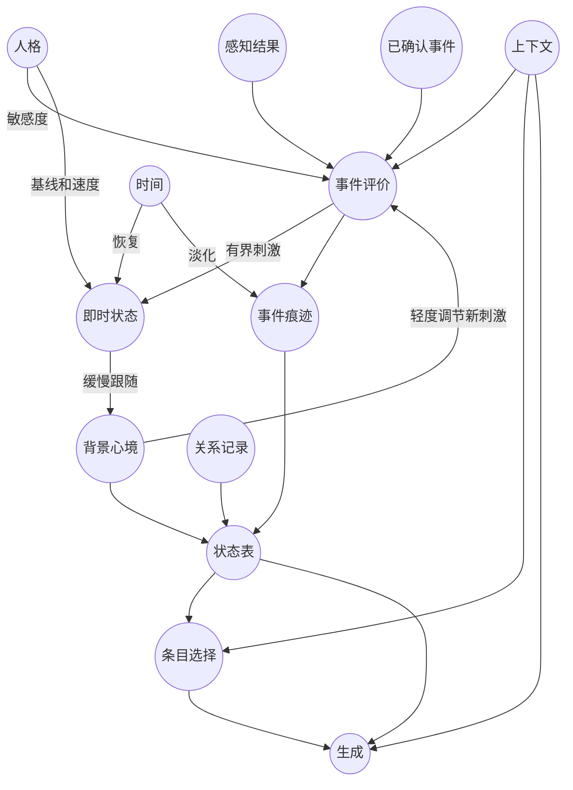

# Loyea 调制器设计与实现规范

版本：v1.0；参考实现：`1.0.0-prototype`；日期：2026-09-10。  
适用项目：Loyea Android / Kotlin。状态表示接口沿用 v0.2。

本版已完成方案选择、参数与交互设计、Python 可执行参考实现和合成输入验证。它是交给 Kotlin 实现者的确定规格；尚未合入 Loyea，也未完成 Android 真机或真实对话效果验收。

## 1. 定案

**采用“事件评价 + 八维连续状态 + 有界事件痕迹 + 滞回输出规则”。**

八维状态由四个即时量和四个背景量组成。事件痕迹保留“为什么产生这种感受”，状态编译器再输出原有状态表。现有本地感知模型继续使用；不训练新的随机森林、神经网络或 MoE，不增加一次远程情绪分析。

| 部分 | 本版选择 | 作用 |
|---|---|---|
| 输入理解 | 旧感知模型 + 确定性适配规则 | 判断这件事对当前角色意味着什么 |
| 状态更新 | 两个时间尺度的解析衰减系统 | 有延续、有恢复，重复事件可以累积 |
| 感受语义 | 最多 8 条带证据的事件痕迹 | 区分愤怒、内疚、担忧等原因不同的感受 |
| 状态表 | 规则筛选 + 滞回分档 | 保持 `aspect / state / intensity` 接口 |
| 回复约束 | 现有活动世界书中的语义筛选 | 把状态落实为本轮可用条目 |
| 长期人格 | 固定 OCEAN 配置 | 调节敏感度、基线与恢复速度 |

参数少与状态词多并不矛盾：连续量决定变化的幅度和时间，事件依据决定词义。只靠几个连续量无法可靠反推“内疚”和“委屈”；为所有词各建一个独立状态机，又会增加组合与维护成本。本版同时保留数值连续性和事件语义。

这些系数是工程初值，目标是可解释、可重复和可调试；不是心理测量量表，也不是拟合出来的神经生理参数。

## 2. 已参考的设计及取舍

| 参考 | 对本项目有用的部分 | 本版取舍 |
|---|---|---|
| [ALMA / DFKI](https://alma.dfki.de/) | 分开处理人格、背景心境和短期情绪，用事件评价驱动变化 | 采用分层和衰减思路；保留 Loyea 自己的词表，不整体替换成 ALMA 的分类 |
| [FAtiMA Toolkit](https://github.com/GAIPS/FAtiMA-Toolkit) | 将情绪评价、情绪决策和社会关系组织成不同组件 | 借鉴“先评价事件，再产生感受”，不把用户情绪直接复制给角色；暂不引入整套 C# 运行组件 |
| [原 HDS](https://github.com/ApolloEddy/Homeostatic_Dynamics_System) | 刺激、稳态、恢复与人格之间存在明确的作用关系 | 保留稳态思想，重写中间变量与输出，不直接套用旧表示层 |

ALMA 已经研究过多时间尺度的情感计算；FAtiMA 的事件评价和决策组件也比单纯“情绪分数转语气”完整。因此本版不把这些思路当作新发明。选择一个小型确定性实现，是结合 Loyea 已有 Kotlin、感知模型和状态表接口作出的工程判断，并非证明它在一般任务上优于这些研究系统。

学习模型需要“连续对话 → 合适的角色内部状态”标注数据。目前恢复的是感知接口，不是这种决策训练集。本版先建立可回放的确定性基线；在没有数据时引入新的学习模型，会把可解释的问题变成难以校准的问题。

## 3. 与先前状态层、ABM、HDS 的关系

依据文件为 `Loyea_State_Representation_Spec_v0.2.md`。完整原文附在实现包的 `reference/` 中。

| 既有约定 | 本版处理 |
|---|---|
| 感知 → 决策 → 生成 | 保持；调制器属于本地决策层 |
| 四个 aspect，三列状态表 | 完整保持，不添加必填 target、cause、expression 列 |
| 31 个当前感受候选 | 全部保留定义；本版实现 15 个，其余保留为未启用候选 |
| 强度与置信度不同 | 保持；置信度只控制证据如何进入系统 |
| 长期 = OCEAN + Plasticity + TotalInteractions | 保持人格配置；后两者不参与短期情绪增益 |
| 旧规范中的“本地状态演化沿用既定状态机” | 本版将这一实现方式更新为连续动力学；输出仍用确定性规则与滞回。依据后续允许重新选择 FSM 的讨论 |
| 旧感知模型不重训、不换头、不增加远程调用 | 保持 |

旧 HDS 的 DA、NE、5-HT 不再作为本版调制器的必经中间量。它们可以用作早期模拟隐喻，但本版直接维护具有明确工程定义的效价、激活、紧张、烦躁。旧 `H_social / H_energy` 也不自动转化为孤独或不耐烦：在缺乏可靠资源定义时，不能仅凭聊天时长或用户离开就推断这些状态。

本版没有额外增加一个“长期 HDS 人格”。OCEAN 是固定配置，背景心境仍属于短期状态系统。过去的 VAR/怨恨值不参与更新，也没有“冒犯次数越多，永久怨恨越高”的计数器。

## 4. 结构与一次更新

图中的“关系记录”是只读输入，不是调制器偷偷推算的亲密度。生成仍接收当前用户原文、必要历史、记忆和 Soul；状态表不能替代这些语义内容。

每次接收一个已提交的新观测，按以下顺序执行：

1. 检查版本、序号、时间、范围与本轮是否已处理。
2. 复制上轮状态，按实际经过时间一次性计算恢复结果。
3. 结合主体、对象、事实性与上下文，把感知结果转换成少量评价事件。
4. 同时更新四个即时量，再更新事件痕迹；此刻不直接跳改背景量。
5. 编译关系两行、背景一行、当前感受最多两行。
6. 结合上下文，从现有活动世界书筛选条目；冻结本轮结果。
7. 由宿主将状态检查点和本轮快照原子保存，再交给生成阶段使用。

无新消息时不需要后台定时循环。下次使用时按经过时间计算即可。时间变化不是新的情绪刺激，生成出的文字也不作为自身下一次情绪刺激。

## 5. 参数设计

### 5.1 八个动态量

每个轴有即时值 `f` 和背景值 `m`，共 8 个 Double。下面的半衰期是人格调节前的基础常量。

| 轴 | 定义与范围 | 即时基础半衰期 | 背景跟随半衰期 |
|---|---|---:|---:|
| `valence` | 正负体验倾向，[-1, 1] | 180 秒 | 1,800 秒 |
| `activation` | 当前激活程度，[0, 1] | 90 秒 | 1,200 秒 |
| `tension` | 尚未解除的紧张负荷，[0, 1] | 240 秒 | 2,400 秒 |
| `irritation` | 易烦躁倾向，[0, 1] | 300 秒 | 2,700 秒 |

`mood` 的半衰期表示跟随即时量的时间尺度；由于即时量也在恢复，不能把它理解为每一种场景下背景数值都恰好按这个时间减半。当前感受还各有独立的痕迹半衰期，见第 7 节。

默认 OCEAN 各 0.5。默认基线为 `[0, 0.2, 0, 0]`，初始 `f = m = baseline`。中性基线不等于快乐、亲密或信任。

### 5.2 OCEAN 的作用

设 O、C、E、A、N 均在 [0,1]。所有函数保持正值且有界。

| 影响位置 | 公式 |
|---|---|
| 激活基线 | `0.10 + 0.20 E` |
| 正向刺激增益 | `0.75 + 0.50 E` |
| 共情刺激增益 | `0.70 + 0.60 A` |
| 指向角色的敌意增益 | `(0.70 + 0.60 N) × (1.15 − 0.30 A)` |
| 挫败／失望增益 | `0.60 + 0.80 N` |
| 新奇刺激增益 | `0.60 + 0.80 O` |
| 修复／自我责任事件增益 | `0.80 + 0.40 C` |
| 中性评价增益 | `1` |
| 即时半衰期倍率 | `(0.75 + 0.75 N) × (1.10 − 0.20 C)` |
| 背景半衰期倍率 | `0.90 + 0.20 N` |

默认即时半衰期实际为 202.5、101.25、270、337.5 秒。人格只改变反应倾向，不能让低宜人性角色忽视既定价值观或把状态当成辱骂用户的指令。

`Plasticity` 保留给独立的长期修订流程，v1 不自动改人格。`TotalInteractions` 由宿主在成功接纳一轮交互后计数；它不放大情绪、不直接提升关系。人格版本变更必须显式迁移检查点，禁止热改系数后继续使用含义已经不同的历史状态。

人格配置和 Soul 描述应归属于同一个版本化角色档案。若旧角色卡只有自然语言人格，可先使用中性数值默认值并保留原文，不在每轮临时解析一次人格。

### 5.3 通用常量

| 项目 | 固定初值 |
|---|---:|
| 证据软门槛 | 0.55 |
| 单事件刺激上限 | 0.90 |
| 单轴每轮混合系数上限 | 0.55 |
| 刺激混合速率 | 0.75 |
| 同类事件抑制窗口 | 45 秒 |
| 窗口内最小增益比例 | 0.25 |
| 同类痕迹累积上限 | 0.95 |
| 痕迹清理阈值 | 0.015 |
| 每轮评价事件上限 | 8 |
| 持久事件痕迹上限 | 8，每条最多 4 个证据 ID |
| 当前感受进入／退出阈值 | 0.18 / 0.12 |
| 背景标签进入／退出阈值 | 0.16 / 0.10 |
| 已选标签竞争加分 | 0.04 |
| 强度分档边界 | 0.30 / 0.55 / 0.80 |
| 强度边界滞回余量 | ±0.03 |

`config/defaults.json` 是参考代码导出的参数登记表，不是已经实现的任意热更新配置引擎。v1 不开放数十个用户滑杆；先按这组值跑通与验收，再用版本化回放修改少量参数。

## 6. 输入契约与感知适配

### 6.1 保留既有模型接口

已核对 `AprilPerceptionDemo-standalone-2.1.4.html`：模型元数据版本为 `2.1.0`，前端解码版本为 `2.1.1`，12 个输出头、82 个 logits，基础情绪 8 项、细粒度 8 项。详细原顺序记录在 `config/legacy_schema.json`；公共词典排序不得改变 logits 的解码顺序。

现有 q8 权重字段大小为 24,085,508 字节。这是权重字节数，不是运行内存或整次推理开销。本轮没有加载权重、执行 ONNX 推理或测量感知准确率。

| 输入字段 | 本版用途 |
|---|---|
| `emotions.*.calibratedProbability` | 基础情绪证据是否可用；不直接等于角色状态强度 |
| `emotions.*.strength` | 对应情绪的输入幅度，在适配与人格增益后才影响状态 |
| `speakerAffectTarget` | 区分自身、听者、第三方、事件等对象 |
| `utteranceFactuality` | 区分真实陈述、否定、假设、转述、不明确 |
| `dialogueAct` | 区分提问、修复、致谢、玩笑等行为 |
| `stances` | 辅助判断敌意、玩笑、亲近、脆弱等表达 |
| `dimensions.toxicity` | 敌意路由的一项辅助证据；单独不足以触发 |
| `fineStates` | 接口保留；v1 不直接复制为角色自身感受 |
| 全局 `confidence`、`effectiveScore`、用户 valence/arousal | 保留原语义；v1 不作为通用置信度或角色内部量直接使用 |
| `referencedAffect` 等引用字段 | 保留接口；v1 通过事实性与上下文保守处理引用，不声称已经完整消歧 |

模型缺失或超时：只执行已有状态恢复，仍可处理已确认宿主事件。解码版本不符、NaN、越界分数：拒绝该次计算并保留上个有效状态；宿主显式使用一次“感知缺失”观测完成该轮降级，不能重复计入已有刺激。

### 6.2 Observation

| 字段 | 含义 |
|---|---|
| `event_id` | 宿主生成的稳定观测 ID；同一输入的重试不换 ID |
| `seq` | 会话内递增序号，非负整数 |
| `at` | 会话逻辑时间，单位秒，单调不减 |
| `perception` | 当前观测的旧模型解码结果，可缺失 |
| `context.topic_id` | 当前主题或场景 ID；无可靠切分时为 `general` |
| `context.scene` | 场景信息；只有明确真实交互 `real` 才走针对角色的敌意路由 |
| `context.visible_evidence` | 本轮生成上下文能够看到的证据 ID，最多 128 个 |
| `context.legitimate_feedback` | 宿主确认的合理纠错标记；不能让情绪规则惩罚纠错 |
| `context.active_tags` | 如 study、conflict 等可靠场景标签，最多 64 个 |
| `context.relations` | 外部已确认的关系记录，只读 |
| `facts` | 最多 8 个有来源的宿主事件，不能直接由 LLM 任意声明 |

ID、主题、标签均最长 128 字符。`visible_evidence` 由当前消息、选入历史、记忆摘要及其来源映射产生；缺少关联的旧感受不进入新表，但其已经形成的背景影响可以自然延续。

**不要假定上表的上下文标记已经被一个模型完美识别。** v1 可直接实现消息 ID、历史可见性、工具结果及手工场景；真实聊天中的主题变化、合理纠错和虚构场景仍需要宿主的保守规则。没有可靠判据时，不捏造确认事件，原文仍交给生成层理解。

### 6.3 旧感知模型触发规则

所有感知路由首先要求 `utteranceFactuality=asserted`，该头置信度 ≥0.65。其他事实性或不足门槛时，本轮不产生感知刺激；已有状态仍正常恢复。

“直接指向角色”还要求：对象为 `listener`、对象置信度 ≥0.75、`scene=real`。各路由采用所需证据中的最低分作为 `confidence`，不借用全局最高分。

| 路由 | 额外条件 | 输入幅度 |
|---|---|---|
| `hostility` | 直接指向角色；hostile≥0.70，toxicity≥0.55，playful<0.55，非已确认合理纠错 | 有效 anger strength 与 toxicity 的较大值；anger presence 需≥0.65 |
| `kindness` | 直接指向角色；致谢或安慰行为，行为置信度≥0.70 | 0.60 |
| `affection` | 直接指向角色；affection presence≥0.70，affiliative≥0.60 | affection strength |
| `repair` | 直接指向角色；道歉修复行为≥0.75，且同主题存在敌意痕迹 | 0.65；关联相关敌意证据 |
| `humor` | 玩笑行为≥0.65，playful≥0.70，hostile<0.55 | 0.65 |
| `user_distress` | 对象是 self、event_object 或 general，置信度≥0.65；sadness/fear presence≥0.70 | 已合格候选中较大的 strength |
| `shared_joy` | 与上一行相同的对象门槛；joy presence≥0.70 | joy strength |

后两行还要求表达属于体验：普通提问／命令不自动视为情绪体验，除非 vulnerable≥0.65。敌意与玩笑信号冲突时，敌意路由放弃判断。这里的门槛是保守初值，并不保证旧模型在讽刺、复杂引用或长文本中一定判断正确。

## 7. 事件、语义与交互矩阵

下表是完整的 v1 刺激表。目标向量顺序为 V、A、T、I；`—` 表示该事件不直接修改此轴，**不表示将该轴清零**。同一行的目标值表示强刺激的趋向，不会一次赋值到这个数。

| 评价事件 | 当前感受 | 增益族 | V | A | T | I | 痕迹半衰期／秒 |
|---|---|---|---:|---:|---:|---:|---:|
| shared_joy | joy 快乐 | positive | 0.80 | 0.55 | — | — | 180 |
| user_distress | compassion 心疼 | empathy | -0.25 | 0.35 | 0.25 | — | 300 |
| kindness | gratitude 感激 | positive | 0.60 | 0.25 | — | — | 240 |
| affection | affection 喜爱 | positive | 0.65 | 0.30 | — | — | 300 |
| hostility | anger 愤怒 | hostility | -0.70 | 0.65 | 0.55 | 0.85 | 240 |
| repair | relief 释然 | repair | 0.30 | 0.10 | 0 | 0 | 150 |
| humor | amusement 被逗乐 | positive | 0.65 | 0.45 | — | — | 120 |
| task_blocked | frustration 挫败 | negative | -0.50 | 0.35 | 0.30 | — | 180 |
| unresolved_information | confusion 困惑 | neutral | — | 0.30 | 0.10 | — | 120 |
| novel_topic | curiosity 好奇 | novelty | 0.25 | 0.40 | — | — | 180 |
| future_threat | worry 担忧 | empathy | -0.35 | 0.45 | 0.60 | — | 360 |
| threat_resolved | relief 释然 | repair | 0.40 | 0.10 | 0 | — | 150 |
| expectation_unmet | disappointment 失望 | negative | -0.60 | 0.20 | — | — | 300 |
| own_harm_confirmed | guilt 内疚 | repair | -0.45 | 0.30 | 0.35 | — | 300 |
| self_achievement | pride 自豪 | positive | 0.65 | 0.50 | — | — | 240 |
| unexpected_event | surprise 惊讶 | neutral | — | 0.70 | — | — | 60 |

前 7 行由旧感知适配产生；其余由宿主的已确认事件产生。以下是宿主事件的具体来源要求，原型实现消费接口，不冒充已经实现了通用自然语言事件识别器。

| 宿主事件 | 可接受的依据 | 不足以作为依据的情况 |
|---|---|---|
| task_blocked | 本轮已选目标对应的任务执行失败记录 | 仅检测到负面词，或与角色目标无关的后台失败 |
| unresolved_information | 当前任务确实缺少必需信息，宿主状态已标记 | 用户随便问一个问题 |
| novel_topic | 已确认的新主题／作者定义的兴趣事件 | 每条新消息都算新奇 |
| future_threat | 尚未解除、与当前角色目标或关切对象有关的风险记录 | 用户 fear 分数高就自动认定有风险 |
| threat_resolved | 明确结果及 `resolves` 指向的原风险证据 | 一句含糊“没事了”却找不到对应事件 |
| expectation_unmet | 既有期待记录与实际结果不符 | 单纯悲伤或低落 |
| own_harm_confirmed | 角色自身行为、影响结果及责任关联得到确认 | 用户说“你应该内疚”，或 shame_guilt 分数较高 |
| self_achievement | 角色自身已确认目标完成 | 用户成功就自动转成角色自豪 |
| unexpected_event | 已登记预期与实际发生的事件显著不符 | 任意感叹号 |

事件包含 `kind, strength, confidence, evidence_id, target, verified, source, resolves`；`verified` 必须是真正布尔值。允许 `source=host` 或 `authored_scenario`。不是来自模型的“confidence=1 就代表真相”：宿主必须先满足相应事件定义，才可将其标为已确认。

尚无可靠来源的事件保持不启用。尤其不能在接入时为了凑齐 15 个词而补一组随意关键词规则。

## 8. 状态更新方程与稳定性

### 8.1 无输入时的解析恢复

每个轴独立使用：

\[
\frac{df}{dt}=-a(f-b),\qquad \frac{dm}{dt}=c(f-m),\qquad
a=\frac{\ln 2}{h_f},\;c=\frac{\ln 2}{h_m}.
\]

设经过时间为 Δ，旧即时、背景值为 f₀、m₀：

\[
f_1=b+(f_0-b)e^{-a\Delta}
\]

\[
m_1=b+(m_0-b)e^{-c\Delta}+(f_0-b)\frac{c(e^{-a\Delta}-e^{-c\Delta})}{c-a}.
\]

若 a=c，最后的系数取 `cΔ exp(−cΔ)`。参考实现对这个极限分支也作了处理。

这个更新不使用 Euler 小步积分。相同初值和无输入间隔，按一次算完与拆成多次计算具有相同的连续量结果，误差只来自浮点运算。手机后台停留一天也不需要补跑一天的 tick。

### 8.2 一次事件如何改变即时状态

事件可信度 cₑ 先经过软门：

\[
w_e=\operatorname{clip}\left(\frac{c_e-0.55}{0.45},0,1\right).
\]

若同 kind、target、topic 的痕迹仍存在，设距上次该类事件的时间为 δ，重复抑制系数为 `r = 0.25 + 0.75 min(1, δ/45)`；首次为 1。刺激幅度：

\[
q_e=\operatorname{clip}(strength_e\,w_e\,gain_e\,r_e\,feedback_e,0,0.90).
\]

背景反馈只开放两条：`future_threat` 乘 `1 + 0.15 m_tension`；`hostility` 乘 `1 + 0.10 m_irritation`；其他事件乘 1。没有新事件时，这两条反馈不产生任何刺激。

对轴 j，只收集明确包含该轴目标的事件集合 Eⱼ：

\[
Q_j=\sum_{e\in E_j}q_e,\quad
z_j=\frac{\sum_{e\in E_j}q_e\,target_{e,j}}{Q_j},\quad
\alpha_j=\min(0.55,1-e^{-0.75Q_j}).
\]

\[
f_j^+=(1-\alpha_j)f_j^-+\alpha_j z_j.
\]

没有作用于该轴的事件时保持其恢复后的值。同轮所有事件先合并再更新，避免“先处理悲伤还是先处理开心”改变即时结果。背景量在此刻保持连续，随后按上一节方程跟随。

### 8.3 事件痕迹

痕迹键为 `(kind, target, topic_id)`；其 strength 随时间按该事件的半衰期衰减。重复有效刺激使用：

\[
s^+=\min(0.95,1-(1-s^-)\,(1-q)).
\]

这是有界工程累积式，不应解释成情绪存在概率。同一观测内完全相同的 `(kind, evidence_id, target)` 去重。每条痕迹只保留最近 4 个不同证据 ID，容量最多 8 条，按强度优先保留；因此它不承担完整事件记忆或长期关系账本的职责。

已确认修复只将所关联痕迹乘 `1 − 0.55q`，不会清空所有感受。修复事件也会缓解部分即时轴，但不会擦掉其他事件的语义记录或直接将背景量重置为中性。

### 8.4 能保证什么

恢复方程是稳定的级联系统。即时量是基线与旧值的凸组合；背景量是基线、旧背景和旧即时量的非负加权组合。所有目标也在合法区间，事件更新仍为凸组合，因此合法初始值始终有界。

没有输入时，f、m 都收敛到基线；痕迹衰减并清理。持续输入时不保证回到中性，但仍保持有界。背景反馈只调节新的有界刺激，不构成无输入时的自我激发。

这证明的是**数值稳定与恢复性质**。它不证明情绪判断正确，也不证明生成层一定表现自然；这些必须用真实感知与对话验收。

## 9. 编译回先前的状态表

### 9.1 四个 aspect

| aspect | 来源 | 默认输出 |
|---|---|---|
| relationship_affect 关系感情 | 外部已确认 RelationView | 1 行；未知为 unspecified / — |
| relationship_trust 关系信任 | 外部已确认 RelationView | 1 行；未知或范围不符为 unspecified / — |
| mood 背景心境 | 四个背景量的确定性评分 | 1 行；无显著候选为 neutral / — |
| feeling 当前感受 | 有证据且与当前情境关联的事件痕迹 | 0–2 行 |

默认总计 3–5 行。v0.2 允许必要时超过两项当前感受；本版参考实现只启用默认预算，不实现额外行数覆盖开关。

关系喜爱不等于当前喜爱；低信任不等于不信任；爱不是数值达到某个门槛后自动晋级。RelationView 的已知非中性状态必须带依据和强度；“未确定”没有强度。技术领域信任不会自动推广为关系承诺上的信任。

如果长期关系模块尚未建成，就输出“未确定”。这使调制器完整满足四个 aspect 接口，而不会暗中虚构另一套长期关系模型。

### 9.2 背景标签计算

设背景值为 V、A、T、I：

| 状态 | 内部评分 |
|---|---|
| cheerful 愉快 | `max(0, V)` |
| gloomy 低落 | `max(0, −V) × (1 − 0.5 A)` |
| tense 紧绷 | `T` |
| irritable 烦躁 | `I` |
| calm 平静 | `1.5 × min(max(0,V), max(0,0.35−A), max(0,0.20−T))` |

新标签评分达到 0.16 才进入；旧标签降到 0.10 以下才退出。竞争时旧标签加 0.04，选最高者；同分按 ID 固定顺序决胜。没有合格候选则输出中性。平静需要一定正向、低激活、低紧张的组合，不因一片空白就自动推断“很平静”。

这些评分用于确定一个背景描述，不是多个标签的概率分布。内部保留四个背景量，即便某一维没有作为本轮主背景展示。

### 9.3 当前感受计算

仅考虑主题一致、证据仍出现在本轮生成上下文中的痕迹；本轮新事件的证据自动可见。同一感受有多个痕迹时取最大强度。按进入 0.18、退出 0.12、旧候选加 0.04 的规则选最多两项。

v1 已实现的 15 个感受：快乐、喜爱、愤怒、惊讶、失望、感激、释然、挫败、被逗乐、好奇、困惑、自豪、心疼、担忧、内疚。其中 7 个可由旧模型适配直接触发，另外 8 个需要宿主事件；释然有两条来源。

保留但不启用的 16 个候选：悲伤、恐惧、厌恶、委屈、孤独、羞愧／内疚（未细分）、期待、兴奋、兴趣、希望、钦佩、情感受伤、羞愧、难为情、无聊、绝望。原定义继续有效，未启用表示尚无本版专门事件规则，不表示角色不可能有这些感受。

新增感受首先补“事件定义、可靠来源、作用目标、增益族和痕迹半衰期”，通常不增加新的连续轴。不能仅因为数值位置接近就把担忧改叫内疚，也不能把旧 `shame_guilt` 自动拆成确定的 shame 或 guilt。

### 9.4 强度与滞回

| intensity | 首次分档区间 | 中文 |
|---|---|---|
| none | 精确且有依据的 0 | 无 |
| mild | (0, 0.30) | 轻微 |
| moderate | [0.30, 0.55) | 中等 |
| strong | [0.55, 0.80) | 强烈 |
| very_strong | [0.80, 1] | 非常强烈 |

已经出现的标签升级需越过边界 +0.03，降级需低于边界 −0.03。例如 0.29→0.31 不来回改档，0.34 才由轻微升为中等。未列出的感受不是 `none`；中性与未确定用 `—`。这些约定与 v0.2 保持一致。

生成层只接收离散档位。内部数值保留在调试快照中，不伪装成精确的心理强度百分比。

### 9.5 输出解释

随表使用 v0.2 的解释约束：表格描述角色当前被显式指定的内部状态；各行可以同时成立；强度不规定外在表现多少；未列出不等于零；本轮表格不自动继承旧表的遗漏条目；自然回应，不逐项表演状态。

例如持续冲突后出现一个笑点，可以同时输出 `mood / irritable / mild` 和 `feeling / amusement / moderate`。不必先把所有背景烦躁清零，才允许“被逗乐”。

## 10. 世界书选择与生成接口

复用 Loyea 已有活动世界书解析与编译流程。本轮核对的仓库结构包含 Kotlin `character-core` 和 `PromptAssembler` 的稳定 Prompt／本轮快照分离；接入点说明见 `integration/Kotlin_Integration.md`。

语义选择器只处理**已经选定的一个活动世界书**中的候选条目。现有会话、角色卡、全局世界书的来源优先级继续由既有 resolver 决定，不另外启动一个世界书系统。

每个可选条目可以带 `states_any`、`context_all`、`priority`、`group`、`enabled`、`always`。普通条目匹配状态条件和全部上下文条件；`always` 仍服从启用状态和预算。同一排他组只选一个。

默认上限为 128 个语义候选、6 个选中条目，参考实现另用 1,600 字符作粗预算。**字符预算不是 token 预算**；实际注入必须继续由现有编译器执行真实 token 计算、条目排序和最终预算。Soul 的固定核心约束在这个可选预算之外。

| 触发组合 | 合适的约束条目示例 |
|---|---|
| compassion + study | 先回应具体困难，再给清楚的处理步骤；不大段渲染担心 |
| anger + confirmed interpersonal conflict | 清楚表达边界，避免羞辱或用关系承诺施压 |
| confusion + unresolved task | 问一个能解除关键歧义的问题 |
| amusement | 可以有一点轻松语气，继续完成当前任务 |

不再把多巴胺、紧张值等内部参数直接交给生成层自由发挥，也不额外输出一套必须逐项执行的“情绪动作”。动态表与选中条目进入本轮上下文，避免每条消息改写稳定 Soul 前缀。

## 11. 事务、重试与失效处理

### 11.1 同一条输入只推进一次

原型保证最新 `event_id + seq` 重试返回已缓存结果，不再更新状态。较早序号、同序号不同 ID、最新 ID 换新序号均拒绝。

**全历史去重由宿主负责。** 核心只记最新观测，不维护无限 ID 集合。宿主查询持久化 TurnSnapshot：旧轮重新生成、重连、工具续轮和 SSE 分片都使用该轮已有快照，不能将旧消息换新 seq 再送入核心。

本轮感知输入和 RelationView 一旦提交便冻结。相同 ID 传入修改后的正文不能当普通重试；编辑旧消息必须新建修订分支或从编辑点以前的检查点回放。

### 11.2 时间

运行中使用单调时钟映射到会话逻辑秒；重启后由宿主根据保存的墙上时间估算休眠时长，取非负间隔，再接续逻辑时间。系统时钟回拨不得产生负衰减；无法确认时间时允许 Δ=0，并记录诊断。

不因为没有聊天自动新增孤独、失望、不信任等事件。缺席只让已有短期状态逐步恢复。

### 11.3 原子提交与检查点

Python 原型采用复制后更新，非法输入不会部分推进实时状态。Android 宿主应在单会话 actor 或互斥范围内处理，并在一个数据库事务中保存新检查点、已处理事件和 TurnSnapshot；事务成功后再替换内存中的正式状态。

检查点含算法版本、人格版本、八个连续量、痕迹、离散滞回记录、最新序号和最新决策。加载检查维度、范围、词表、关联决策和有界容量；坏检查点不可默默部分载入。宿主优先从最近有效检查点回放；无有效状态时显式恢复基线并记录原因，不把损坏当成角色突然忘记关系。

关系的长期原始记录与短期检查点分开存放。删除一条短期痕迹、预算筛除一条 Lore 或调制器降级，都不能顺带改写关系记录。

## 12. 已完成的验证与验收门槛

本轮结果：**34 项测试通过**；32 组 OCEAN 极端组合各运行 500 步，共 16,000 步；另外检查 100 组随机状态的时间分段一致性，并以独立 RK4 积分核对解析解。

| 已覆盖的风险 | 结果 |
|---|---|
| 用户难过被复制成角色自身悲伤 | 规则产生心疼，保留主体区别 |
| 对第三方发怒被算成对角色敌意 | 不走直接敌意路由 |
| 否定、假设、转述、歧义玩笑 | 不在缺少所需证据时产生敌意刺激 |
| 一条中性消息重置旧状态 | 不重置；只按时间恢复 |
| 当前笑点抹去持续背景烦躁 | 背景连续，可与被逗乐共存 |
| 重试、旧序号、非法输入与损坏快照 | 不重复推进或部分提交 |
| 同轮事件顺序、长休眠、极端人格 | 连续量保持有界，并按定义恢复 |
| 强度阈值附近来回跳档 | 滞回避免小幅波动触发改档 |
| 修复 A 事件顺带清空 B 事件 | 仅衰减所关联痕迹 |

在本轮 Linux / Python 3.12 环境中，用 8 个事件、8 条活动痕迹和 128 个 Lore 候选做 6,000 次测量：调制器加选择器 p95 约 **0.255 ms**。完整范围、分位数和原始记录见 `validation/Validation_Report.md`。这个数字不包含旧模型推理、数据库、网络、LLM，也不是手机端性能承诺。

`integration/golden_cases.json` 提供 7 组、50 次观测的逐步期望结果。Kotlin 移植必须满足：连续量误差≤1e−10，状态表和证据行为一致；原型单测涉及的拒绝、重试与滞回语义也要移植。

真机接入验收仍需完成三个具体工作：

1. 在目标 Android 设备上分别测感知、调制、持久化和整轮链路，报告 p50/p95 与连续使用温升；调制阶段目标先定 p95<2 ms，属于待测目标。
2. 用真实中文对话覆盖纠错、讽刺、引用、学习问答、情绪分享和话题切换，记录错误触发。先修事件适配，不先改动力学。
3. 在同一生成模型和提示词预算下对照启用／禁用调制器，检查主体混淆、状态连续性和过度表演；不能只看数学曲线判断陪伴体验。

这三项是 Android 集成与产品验收任务，不会推翻已经完成的参数规格。当前没有真实回放数据支持“自然度已提升”或“手机不会发热”的结论。

## 13. 交付与实现顺序

实现包包含参考代码、34 项测试、参数登记、状态词登记、旧模型接口登记、7 组跨语言回放数据、验证报告和原状态层规范。

下游实现按以下顺序执行：

1. 将核心数学和数据结构移植到纯 Kotlin 模块，跑通 golden cases；不改这版系数。
2. 接上旧感知解码结果，保持 `2.1.0 / 2.1.1` 双版本检查；先开放现有 7 条感知路由。
3. 接入可靠的任务事件、上下文可见性和只读关系视图；没有事件生产者的扩展保持关闭。
4. 在已有本轮 Prompt 快照中加入状态表与已选条目，完成数据库事务和全历史重试复用。
5. 完成第 12 节真机及对话验收，再决定是否调整有限参数。

原型运行：`python3 prototype/demo.py`。验证：`python3 -m unittest discover -s tests -v`。完整复现：`python3 validation/run_validation.py`；核心和测试只需标准库，画图可选依赖 matplotlib。
